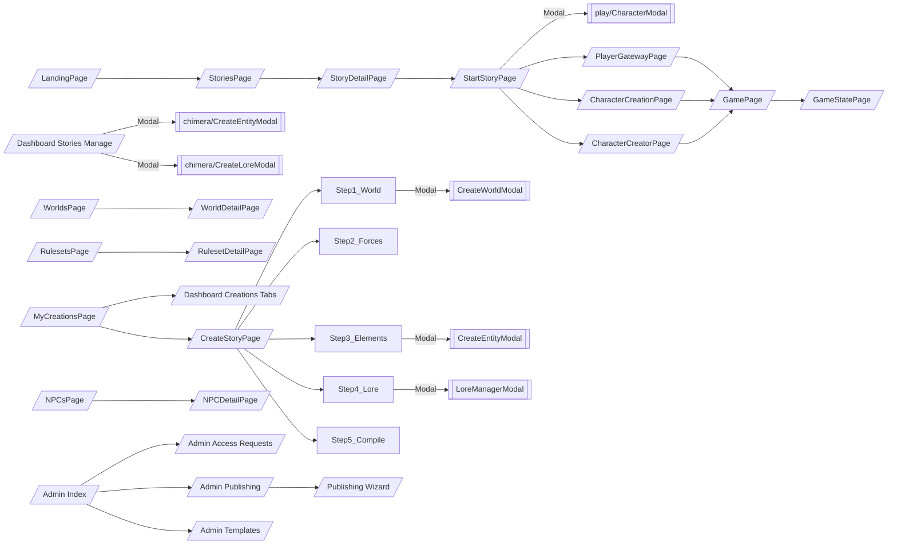

# StoneCaster Page, Component & Feature Hierarchy

This reference expands every routed surface in the frontend, explains the core features it delivers, and lists the shared components or feature modules each page assembles. Use it as a living map when planning UX changes or tracing dependencies.

---

## Global Shell & Routing

- `src/App.tsx`
  - Purpose: bootstraps theming, auth, wallets and query caching before mounting the router.
  - Features: suspense-free auth gating, early-access enforcement, toast plumbing, redirect glue for legacy `/adventure` links.
  - Components: `ThemeProvider`, `QueryClientProvider`, `AuthProvider`, `AccessStatusProvider`, `WalletProvider`, `components/layout/AppLayout`, `ProtectedRoute`, `EarlyAccessRoute`, `admin/AdminRouteGuard`, `components/AuthRouter`, `components/ui/SkipNavigation`, `components/ui/toast-provider`, `components/ErrorBoundary`, `components/redirects/AdventureToStoryRedirect`.

---

## Public / Marketing / Auth

- `/` → `pages/LandingPage.tsx`
  - Features: hero marketing copy, CTA buttons to stories/request access, early-access banner slot.
  - Components: `earlyAccess/EarlyAccessBanner`.
- `/auth` → `pages/AuthPage.tsx`
  - Features: email/password and magic-link auth forms, tabbed sign-in/up UX, inline validation messaging.
  - Components: `ui/alert`, `ui/button`, `ui/card`, `ui/input`, `ui/label`, `ui/separator`, `ui/tabs`.
- `/auth/success` → `pages/AuthSuccessPage.tsx`
  - Features: Supabase OAuth handshake completion view with polling/redirect controls.
  - Components: `ui/button`, `ui/card`.
- `/request-access` → `pages/RequestAccessPage.tsx`
  - Features: waitlist form (role selection, motivation text), acknowledgement badges, policy copy.
  - Components: `ui/alert`, `ui/badge`, `ui/button`, `ui/card`, `ui/checkbox`, `ui/input`, `ui/label`, `ui/textarea`.
- `/support` → `pages/SupportPage.tsx`
  - Features: FAQ accordion/content blocks, embedded contact CTA (native JSX only).
- `/profile` → `pages/ProfilePage.tsx`
  - Features: personal info editing, session revocation, avatar upload, security controls.
  - Components: `common/MediaUploader` plus bespoke profile sections.
- `/not-found` → `pages/NotFoundPage.tsx`
  - Features: 404 messaging with CTA back to dashboard or homepage.
  - Components: `ui/button`, `ui/card`.
- `/casting-circle` → `pages/casting-circle/index.tsx`
  - Features: placeholder content signalling upcoming experience.

---

## Catalog & Discovery Surfaces

- `/stories` → `pages/stories/StoriesPage.tsx`
  - Features: searchable/filterable story grid, analytics tracking for catalog views and card clicks, empty-state messaging.
  - Components: `catalog/CatalogGrid`, `catalog/CatalogCard`, `catalog/CatalogSkeleton`, `catalog/EmptyState`, `filters/WorldsFilterBar`.
- `/stories/:id` → `pages/stories/StoryDetailPage.tsx`
  - Features: hero overview, tags, world/rule callouts, CTA into Start Story flow, related assets panel.
  - Components: `catalog/CatalogGrid`, `catalog/CatalogCard`, `gameplay/StoneCost`, `gameplay/WorldRuleMeters`, `layout/Breadcrumbs`, `ui/badge`, `ui/button`, `ui/card`, `ui/separator`.
- `/worlds` → `pages/worlds/WorldsPage.tsx`
  - Features: world directory with filters mirroring Stories experience.
  - Components: `catalog/CatalogGrid`, `catalog/CatalogCard`, `catalog/CatalogSkeleton`, `catalog/EmptyState`, `filters/WorldsFilterBar`.
- `/worlds/:slug` → `pages/worlds/WorldDetailPage.tsx`
  - Features: lore sections, tabbed stats, related stories grid, CTA to author dashboards.
  - Components: `catalog/CatalogGrid`, `catalog/CatalogCard`, `catalog/CatalogSkeleton`, `catalog/EmptyState`, `layout/Breadcrumbs`, `ui/badge`, `ui/button`, `ui/card`, `ui/tabs`.
- `/rulesets` → `pages/rulesets/RulesetsPage.tsx`
  - Features: browse-able ruleset list highlighting action resolution types, filter chips, loading skeletons.
  - Components: `catalog/CatalogGrid`, `catalog/CatalogCard`, `catalog/CatalogSkeleton`, `catalog/EmptyState`, `filters/RulesetsFilterBar`.
- `/rulesets/:id` → `pages/rulesets/RulesetDetailPage.tsx`
  - Features: ruleset spec detail, dependent packs list, breadcrumbs, CTA to clone/edit.
  - Components: `catalog/CatalogGrid`, `catalog/CatalogCard`, `catalog/CatalogSkeleton`, `catalog/EmptyState`, `layout/Breadcrumbs`, `ui/badge`, `ui/button`, `ui/card`.
- `/npcs` → `pages/npcs/NPCsPage.tsx`
  - Features: NPC library grid, filters by world/type, empty-state when no assets.
  - Components: `catalog/CatalogGrid`, `catalog/CatalogCard`, `catalog/CatalogSkeleton`, `catalog/EmptyState`, `filters/WorldsFilterBar`.
- `/npcs/:id` → `pages/npcs/NPCDetailPage.tsx`
  - Features: biography layout, breadcrumb nav, CTA to edit asset.
  - Components: `layout/Breadcrumbs`, `ui/badge`, `ui/button`, `ui/card`.

---

## Gameplay & Session Flows

- `/play/start` → `pages/play/StartStoryPage.tsx`
  - Features: funnel analytics, auth/guest choice, character selection/creation, confirmation summary, idempotent session start.
  - Components: `catalog/EmptyState`, `play/CharacterCard`, `play/CharacterModal`, `play/StoryStartSummary`, `ui/badge`, `ui/button`, `ui/card`.
- `/player-gateway/:storyId` → `pages/play/PlayerGatewayPage.tsx`
  - Features: quick-start prefab characters, resume owned avatars, CTA to creation page.
  - Components: `ui/button`, `ui/card`.
- `/create-character/:storyId` → `pages/play/CharacterCreationPage.tsx`
  - Features: lightweight form for single-character creation pipeline.
  - Components: `ui/button`, `ui/card`, `ui/input`, `ui/label`, `ui/select`.
- `/play/create/:storyId` → `pages/play/create/CharacterCreatorPage.tsx`
  - Features: advanced character builder with biography fields, stats, textarea prompts.
  - Components: `ui/button`, `ui/card`, `ui/input`, `ui/label`, `ui/select`, `ui/textarea`.
- `/play/:gameStateId` → `pages/play/GamePage.tsx`
  - Features: narration feed, action input with optimistic logging, MAS output display, stats sidebar, toast handling for errors.
  - Components: `game/NarrativeFeed`, `game/ActionInput`, `game/StatsPanel`, `ui/button`, `ui/card`.
- `/play/:gameStateId?debug=true` → `pages/play/GameStatePage.tsx`
  - Features: developer-focused play surface exposing debug info (MAS1/MAS2 payloads), manual message log, alt input widget.
  - Components: `play/PlayInput`, `play/MessageLog`, `play/DebugPanel`, `ui/button`, `ui/card`.

---

## Authoring, Creation & Dashboard

- `/my-creations` → `features/dashboard/MyCreationsPage.tsx`
  - Features: shortcut cards into worlds/entities/lore/packs tabs, CTA to Create Story wizard.
  - Components: `ui/card`, `ui/button`.
- `/create-story` → `features/create-story/components/CreateStoryPage.tsx`
  - Features: Casting Circle wizard orchestration, draft loading/persistence, auto-step routing.
  - Components: `StoryWizardLayout`, steps `Step1_World`, `Step2_Forces`, `Step3_Elements`, `Step4_Lore`, `Step5_Compile`, support modals `CreateWorldModal`, `CreateEntityModal`, `EntityManagerModal`, `LoreManagerModal`, browsing helpers `EntityBrowser`, `EntityCard`, `RulesetFilterBar`.
- `/dashboard/creations/:tab` → `pages/dashboard/creations/index.tsx`
  - Features: unified dashboard with tabs for Worlds, Entities, Stories, Packs, Lore including table actions and filters.
  - Components: `ui/tabs`, tab bodies reuse `ui/card`, `ui/table`, `ui/button`, `ui/badge`.
- `/dashboard/worlds/(new|edit/:id)` → `pages/dashboard/worlds/Editor.tsx`
  - Features: create/edit forms with validation, save actions.
  - Components: `editors/WorldForm`, `ui/button`.
- `/dashboard/worlds/:id/manage` → `pages/dashboard/worlds/Manage.tsx`
  - Features: operations panel for publish/delete/resume tasks (buttons + inline sections).
  - Components: `ui/button`.
- `/dashboard/entities/(new|edit/:id)` → `pages/dashboard/entities/Editor.tsx`
  - Features: entity schema editor, preview, save interactions.
  - Components: `editors/EntityForm`, `ui/button`.
- `/dashboard/entities/:id/manage` → `pages/dashboard/entities/Manage.tsx`
  - Features: management actions (publish, archive) for individual entities.
  - Components: `ui/button`.
- `/dashboard/packs/(new|edit/:id)` → `pages/dashboard/packs/Editor.tsx`
  - Features: pack metadata editor, progress indicator, slot selection.
  - Components: `ui/card`, `ui/checkbox`, `ui/input`, `ui/label`, `ui/progress`, `ui/select`, `ui/textarea`, `ui/button`.
- `/dashboard/packs/:id/manage` → `pages/dashboard/packs/Manage.tsx`
  - Features: runtime management actions for packs (publish/delete).
  - Components: `ui/button`.
- `/dashboard/lore/(new|edit/:id)` → `pages/dashboard/lore/Editor.tsx`
  - Features: lore fragment composer with entity linking, prompt helper.
  - Components: `chimera/ComplexAssetSelector`, `ui/card`, `ui/command`, `ui/input`, `ui/label`, `ui/popover`, `ui/textarea`, `ui/button`.
- `/dashboard/lore/:id/manage` → `pages/dashboard/lore/Manage.tsx`
  - Features: lifecycle management for lore fragments.
  - Components: `ui/button`.
- `/dashboard/stories/:id/manage` → `pages/dashboard/stories/Manage.tsx`
  - Features: story version controls, entity/lore staging via modals, tabbed metadata panes.
  - Components: `chimera/modals/CreateEntityModal`, `chimera/modals/CreateLoreModal`, `ui/button`, `ui/card`, `ui/label`, `ui/tabs`, `ui/textarea`.
- `/dashboard/stories/:id/studio` → `pages/dashboard/stories/Studio.tsx`
  - Features: interactive story studio with accordion-based editor, asset selectors, inline creation modals.
  - Components: `chimera/ComplexAssetSelector`, `chimera/modals/CreateEntityModal`, `chimera/modals/CreateLoreModal`, `ui/accordion`, `ui/button`, `ui/card`, `ui/input`, `ui/label`.

---

## Publishing & Wizard Tooling

- `/publishing/wizard` → `pages/publishing/wizard.tsx`
  - Features: multi-step publishing flow, rollout gating, progress tracking, server-sync for resume.
  - Components: `ui/alert`, `ui/badge`, `ui/button`, `ui/card`, `ui/dialog`, `ui/progress`.
- `/admin/publishing` → `pages/admin/publishing/index.tsx`
  - Features: submission queue dashboards, batch actions, filters, inline editors.
  - Components: `ui/badge`, `ui/button`, `ui/card`, `ui/dialog`, `ui/input`, `ui/label`, `ui/select`, `ui/table`, `ui/tabs`, `ui/textarea`.
- `/admin/publishing/audit` → `pages/admin/publishing/audit.tsx`
  - Features: audit trails, filterable logs, export buttons.
  - Components: `ui/badge`, `ui/button`, `ui/card`, `ui/input`, `ui/label`, `ui/select`, `ui/table`.
- `/admin/publishing-wizard/[entityType]/[entityId]`
  - Features: detail drilldown with badge-based status, quick actions.
  - Components: `ui/alert`, `ui/badge`, `ui/button`, `ui/card`.

---

## Admin Control Center

- `/admin` → `pages/admin/index.tsx`
  - Features: overview cards linking to each admin vertical, access checks.
  - Components: `ui/badge`, `ui/card`.
- `/admin/access-requests` → `pages/admin/access-requests/index.tsx`
  - Features: list + review modals for early-access applicants, tabbed pending/processed filters.
  - Components: `ui/card`, `ui/table`, `ui/button`, `ui/dialog`, `ui/input`, `ui/label`, `ui/textarea`, `ui/tabs`, `ui/badge`.
- `/admin/media/approvals` → `pages/admin/media/ApprovalsPage.tsx`
  - Features: asset approval queues, status filters, decision controls.
  - Components: `admin/media/ApprovalsTable`, `ui/button`, `ui/card`, `ui/input`, `ui/label`, `ui/select`.
- `/admin/roles` → `pages/admin/roles/index.tsx`
  - Features: role assignment management, invite flows, alerts for permission mismatches.
  - Components: `ui/alert`, `ui/badge`, `ui/button`, `ui/card`, `ui/dialog`, `ui/input`, `ui/label`, `ui/select`, `ui/table`.
- Chimera data admin (`pages/admin/chimera/**`)
  - `Dashboard.tsx`: placeholder analytics overview.
  - `worlds/WorldListPage.tsx`
    - Features: list with CRUD controls for worlds.
    - Components: `ui/badge`, `ui/button`, `ui/card`, `ui/table`.
  - `worlds/WorldEditorPage.tsx`
    - Features: world create/edit UI.
    - Components: `editors/WorldForm`, `ui/button`.
  - `entities/EntityListPage.tsx`
    - Features: entity listing with filters/actions.
    - Components: `ui/badge`, `ui/button`, `ui/card`, `ui/table`.
  - `entities/EntityEditorPage.tsx`
    - Features: entity edit surface.
    - Components: `editors/EntityForm`, `ui/button`.
  - `rulesets/index.tsx`
    - Features: ruleset listing, pagination, actions.
    - Components: `ui/badge`, `ui/button`, `ui/card`, `ui/table`.
  - `rulesets/Editor.tsx`
    - Features: prompt/ruleset editor with dependency controls.
    - Components: `ui/alert`, `ui/button`, `ui/card`, `ui/checkbox`, `ui/input`, `ui/label`, `ui/select`, `ui/separator`, `ui/textarea`.
  - `tags/index.tsx`
    - Features: taxonomy management with modal editing.
    - Components: `ui/badge`, `ui/button`, `ui/card`, `ui/checkbox`, `ui/dialog`, `ui/input`, `ui/label`, `ui/table`.
- `/admin/templates` → `pages/admin/TemplatesManager.tsx`
  - Features: prompt template listing/history, editor & preview actions, publish workflow.
  - Components: `ui/alert`, `ui/badge`, `ui/button`, `ui/card`, `ui/input`, `ui/label`, `ui/select`, `ui/table`, `ui/tabs`, `ui/textarea`.

---

## Miscellaneous Utility & Test Pages

- `/support` (FAQ) and `/GamePage.layer-p1.test.tsx` (test harness) rely on bespoke or test-only markup; no additional shared components beyond the ones enumerated above.

---

## Page ↔ Component Flow Diagram

The diagram emphasizes major user journeys (discovery → play, creation → modals, admin hubs) and which modals/components are invoked along the way. Extend it alongside this document whenever new flows or modals are introduced.
