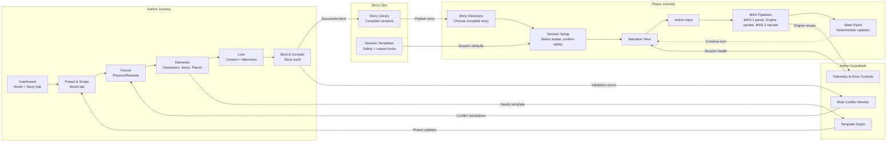
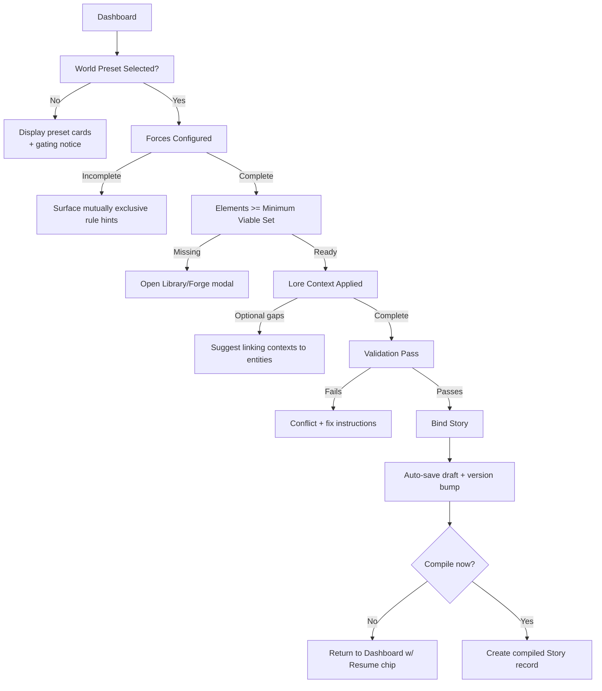
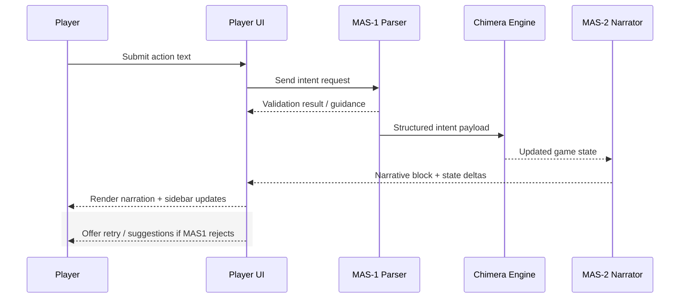
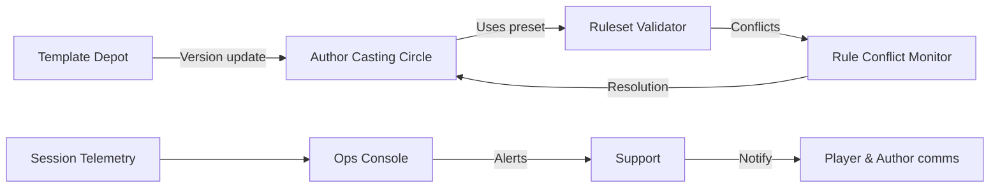

# StoneCaster UX Flow Reference (Mermaid)

This document captures the core UX journeys for the StoneCaster MVP using Mermaid diagrams so the team can keep flows synchronized with the ever-evolving architecture specifications in `docs/`. It mirrors the structure of the archived NotebookLM UX notes but focuses on visualizing state transitions.

---

## Document Goals

- Provide a quick visual map of how Author, Player, and Admin roles traverse the product.
- Emphasize deterministic transitions so the UX mirrors Chimera's rule-driven engine.
- Highlight key UI/system checkpoints that must exist for the MVP.

---

## Personas & Primary Success Criteria

### Author
- Compose or edit a world draft, stitch in Forces/Elements/Lore, and compile a playable story with confidence.
- Understand gating (e.g., presets lock/unlock later tabs) and see validation feedback before binding.

### Player
- Discover a compiled story, launch a session, and stay in flow while MAS pipelines resolve actions and update state.
- Receive clear guidance when inputs are invalid or the engine needs more information.

### Admin / Maintainer
- Seed templates, guardrails, and diagnostics that keep the Author and Player surfaces predictable.
- Resolve schema conflicts or deployment issues without leaving the ops surface.

---

## Experience Flyover (multi-persona)

The diagram below stitches the major persona journeys into a single loop so dependencies are explicit.

---

## Authoring Flow – Interaction & System States

The authoring experience remains tabbed ("Casting Circle") with deterministic gating. The Mermaid flow highlights validation checkpoints that must pass before Bind.

**Key Notes**
- Tabs remain disabled until the prior milestone reports "Complete" to prevent partial binds.
- Draft states auto-save after every major milestone (`W`, `F`, `E`, `L`).
- Validation drawer aggregates schema and safety warnings so Authors can fix issues inline.

---

## Player Session Loop

Players see a single-page experience anchored by Narration, Action Input, and State Panel. The session loop diagram shows where MAS components interact with UI feedback.

**Session Guardrails**
- MAS-1 errors never clear the action field; the UI simply injects guidance inline.
- MAS-2 deliveries stream into the narration window, but state deltas also render inside the sidebar (and optionally in compact turn cards).
- Auto-save checkpoints fire after every successful Engine update so rejoining a session restores the last turn.

---

## Admin & Support Touchpoints

While Admin users rarely appear in front of players, their tooling keeps flows reliable. The smaller flow below shows how ops tasks influence authoring and play.

**Operational Expectations**
- Template edits propagate version numbers so Authors immediately know when presets have drifted.
- Rule Conflict Monitor surfaces binding issues in real-time, reducing failed compiles.
- Telemetry drives proactive outreach when MAS latency or Engine faults rise.

---

## Next Use

- Designers can drop these Mermaid blocks directly into Notion / Markdown workspaces to keep diagrams reproducible.
- Engineers can align validation hooks and telemetry events with the checkpoints shown here.
- Product can expand each node into acceptance criteria, ensuring UX fidelity remains in lockstep with the Chimera architecture spec.
