# 06 UX Visual Mockups
*(StoneCaster / Chimera Engine – MVP)*

This companion doc translates the detailed specs in `06_UX_Feature_Specs.md` into lightweight wireframes/visual notes. Each diagram references sections of the primary spec for behavior/logic.

---

## 1. Global Navigation & Layout Skeleton

```
┌───────────────────────────────────────────────────────────────────────┐
│ Logo        Worlds  NPCs  Stories                 My Stories  Creations│
│                                                                     ◉ │
└───────────────────────────────────────────────────────────────────────┘
                     ↑                      ↑                   ↑
                (Discovery)          (Player Hub)          (Author Hub)
```

- Sticky nav with three groupings (see §1.2–1.3 of feature spec).
- Mobile: collapse Discovery into horizontal scroll, move Profile into kebab menu.
- StoneCaster logo and **My Stories** both land on `/my-stories` for quick resumption of sessions.
- **Worlds** and **NPCs** open discovery browsers, which can chain into modals showing worlds, entities, and stories.
- **My Creations** routes to dashboard tabs; Stories tab links straight into Casting Circle via **Cast New Story**.

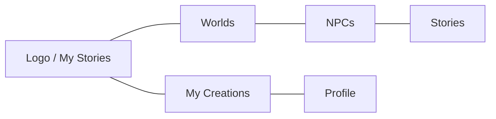

---

## 2. Resource Browser Shell (`/worlds`, `/npcs`, `/stories`)

```
┌──── Filter Sidebar ────┐┌──────────── Cards Grid / Empty / Loading ──────┐
│ Search [__________]    ││┌────────────┐ ┌────────────┐ ┌────────────┐     │
│ Genres  [ ] Cozy       │││   Card     │ │   Card     │ │   Card     │ ... │
│ Rules   [x] D100       │││ Play CTA   │ │ Play CTA   │ │ Play CTA   │     │
│ Safety  [ ] Teen       ││└────────────┘ └────────────┘ └────────────┘     │
│ Reset Filters          ││                                                 │
└────────────────────────┘└─────────────────────────────────────────────────┘
```

- Cards open **Detail Modal** overlay (below). Search/sort/pagination controls align with §2.1 notes.

### Detail Modal Overlay (Shared)

```
┌────────────────────────────────────────────────────────────────────┐
│  Cover/Portrait      |  Tabs: Overview | Stories | Lore | ...      │
│  Quick Stats         |------------------------------------------------
│  Primary CTA (Play)  |  [Tab content scrolls independently]        │
│  Secondary CTA       |                                              │
└────────────────────────────────────────────────────────────────────┘
```

- Worlds: Tabs = Overview, Stories, Entities, Lore, Rulesets.
- NPCs: Overview, World, Stories, Lore, Relationships.
- Stories: Overview, World & Rules, Cast, Lore Hooks, Sessions.

#### Worlds Card Flow

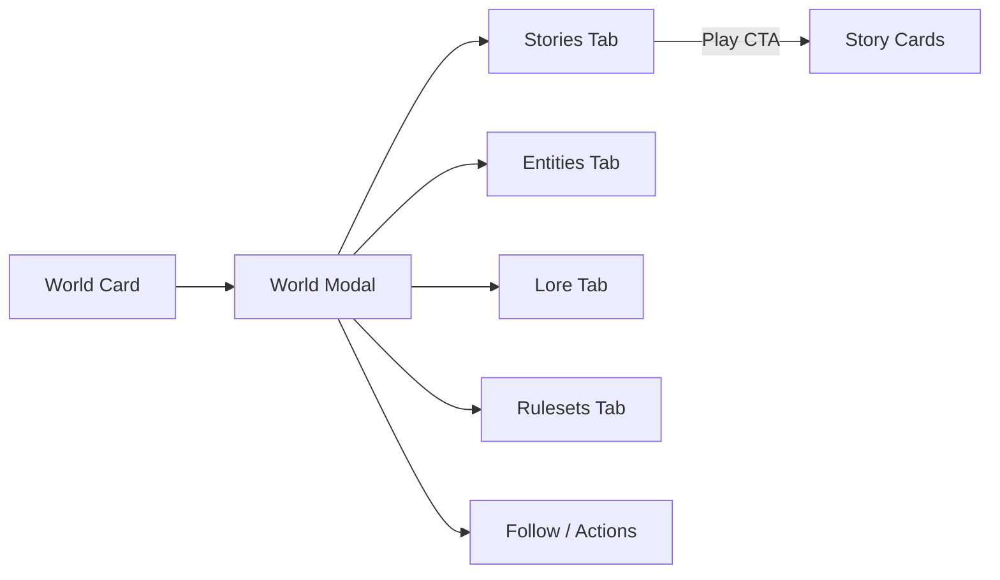

#### NPC Card Flow

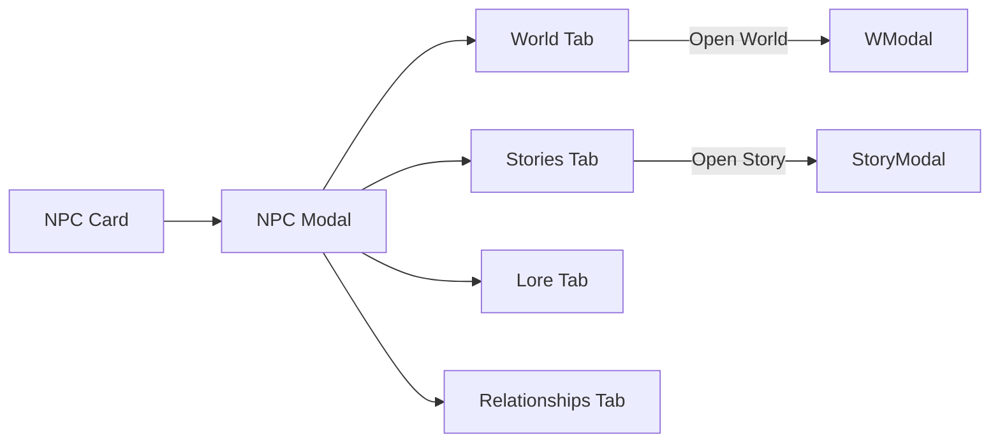

#### Story Card Flow

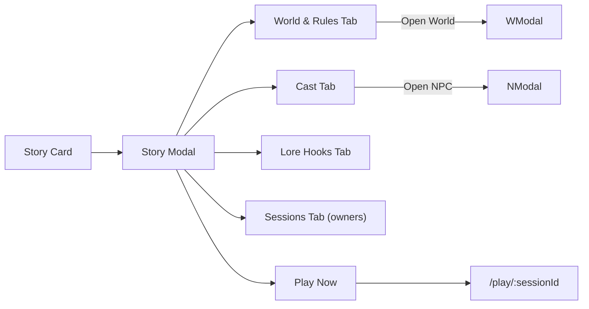

---

## 3. My Stories (`/my-stories`)

```
My Adventures                              + Sort ▼
┌────────────────────────────────────────────┐ ┌──────────────────────────┐
│ Cover │ Story Title        │ Resume  ▶     │ │ Cover │ Completed Story? │
│       │ Last Played 2d ago │ Abandon       │ │ ...   │ Resume disabled   │
│ Badges: World • Difficulty │ State: Dawn   │ │ ...   │ Archive CTA       │
└────────────────────────────────────────────┘ └──────────────────────────┘

Empty State:
[Compass Icon]
"No active adventures..."  [Browse Stories]
```

- Resume = primary action; Abandon triggers confirm modal per §2.2.

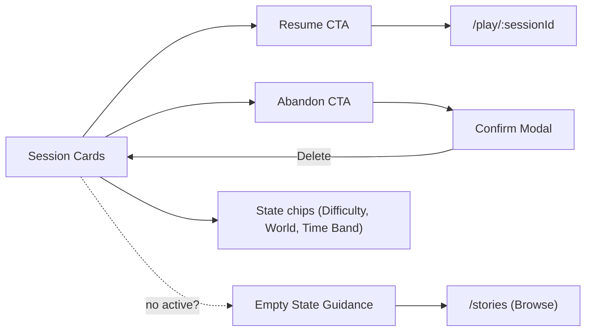

---

## 3.1 Play Session Experience (`/play/:sessionId`)

```
┌─────────────── Game Log (scrollable) ───────────────┐┌─ State Sidebar ──┐
│ Narration chunk                                     ││ Time Band        │
│ [Resolution summary chips]                          ││ Conditions       │
│                                                     ││ NPC spotlight    │
│ Player action input history                         ││ Resources Bars   │
└─────────────────────────────────────────────────────┘└──────────────────┘
[Action Input Field____________________]  [Send ▶]
[System Controls: Undo? | Save | Help | View Lore Pulls]
```

**Functional Requirements**

1. **Action Input:** Supports multiline input, slash commands for emotes/system actions, and displays MAS-1 parsing tooltip on submit.
2. **Game Log:** Mixed timeline of narration, player entries, and system notices with ability to expand past turns or filter by narrator/system.
3. **State Sidebar:** Shows Tier1 stats (stamina, hunger), time band, location, party relationships, and condition badges; updates after each turn.
4. **Resolution Drawer:** Optional accordion that reveals full state_delta + mechanical rolls for debug/testing.
5. **Lore Peek:** Button to reveal which lore fragments MAS-2 pulled for transparency.
6. **Session Controls:** Resume/back to My Stories, Abandon, Download transcript (for authors), and bug report hook.

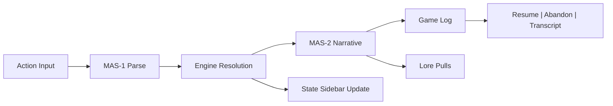

---

## 4. Authoring Dashboard (`/dashboard`)

```
My Creations                              Alerts (Pending approvals)
┌─ Tabs ──────────────────────────────────────────────────────────────┐
│ Stories | Worlds | Entities                                        │
└────────────────────────────────────────────────────────────────────┘

Stories Tab Example:
[Cast New Story] (primary)
┌────────────────────────────────────────────────────────────────────┐
│ Title       | World      | Version | Status | Actions (Play, Manage)│
├────────────────────────────────────────────────────────────────────┤
│ Sunforge... | Emberwild  | v3      | Draft  | ▶ ⚙ 🗑               │
└────────────────────────────────────────────────────────────────────┘
```

- Column visibility toggles + bulk select per §3.2.

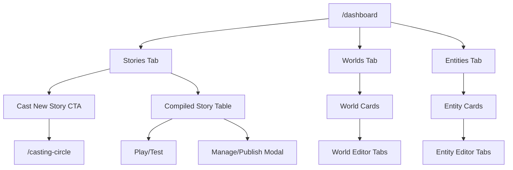

### Worlds / Entities Cards

```
┌───────────────┐
│ World Title   │ Status badge
│ Biome, Rules  │ Last Edited
│ CTA: Edit →   │ Locked? show banner
└───────────────┘
```

Editors inside cards follow tabbed layout (Details | Configuration | Lore for worlds, Identity | Personality | Background for entities). The same modal overlay is invoked when jumping in from Casting Circle or any resource modal when the user owns the content, so edits never yank people out of their flow.

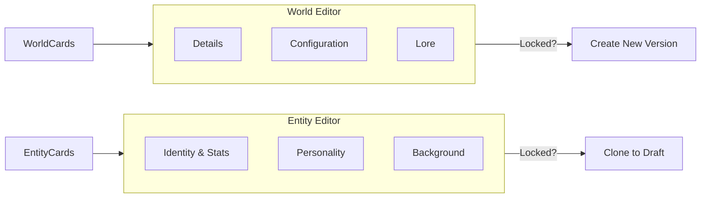

---

## 5. Casting Circle Wizard (`/casting-circle`)

```
┌─────────────────────────────────────────────┐
│ World | Forces | Elements | Bind            │
│ (✓)     (lock)   (lock)     (lock)          │
└─────────────────────────────────────────────┘

[Tab Panel]
World List (radio)
  ○ Emberwild
  ● Sunspire (selected)
Validation summary / CTA "Continue"

Bind Step:
┌ Compile Log ────────────────────────────────┐
│ ✓ World validated                           │
│ ⚠ Missing lore entry                        │
│ ...                                         │
└────────────────────────────────────────────┘
[Compile Story] button (disabled until no blocking errors)
```

- Mirrors flow described in §4 with autosave + error summary.

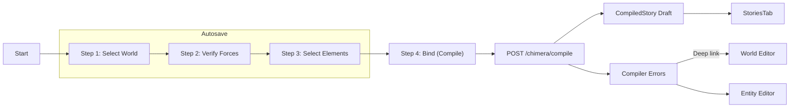

---

## 6. Manage/Publish Modal

```
┌────────────────────────────────────────────┐
│ Draft → Pending                            │
│ Title / Version / Status                   │
│--------------------------------------------│
│ Justification [multiline input 0/240]      │
│ [ ] I certify guidelines                   │
│                                            │
│ Cancel                 Publish to Public ▶ │
└────────────────────────────────────────────┘
```

- Pending state swaps CTA for “Cancel Request”; Published adds “Unpublish” + “Create New Version” button per §5.2.

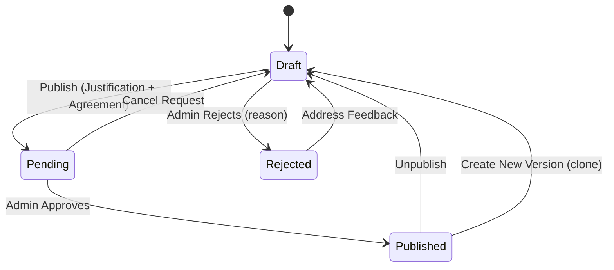

---

## 7. Cross-Linking & Usage

- Use this doc during standups/handoff for quick visual refresher.
- For behavior, edge cases, and statuses always refer back to `06_UX_Feature_Specs.md` (kept as the canonical requirements list).

---

## 8. Profile & Author Surfaces

### 8.1 Profile Hub

```
┌────────── Profile ──────────┐
│ Avatar  Display Name [Edit] │
│ Email / Auth details        │
│ Account Tier / Subscription │
│ Buttons: Manage Billing,    │
│ Security, Notification prefs│
└─────────────────────────────┘
```

- Tabs: `Account`, `Security`, `Notifications`.
- Quick links to `My Stories`, `My Creations`, Purchases history.

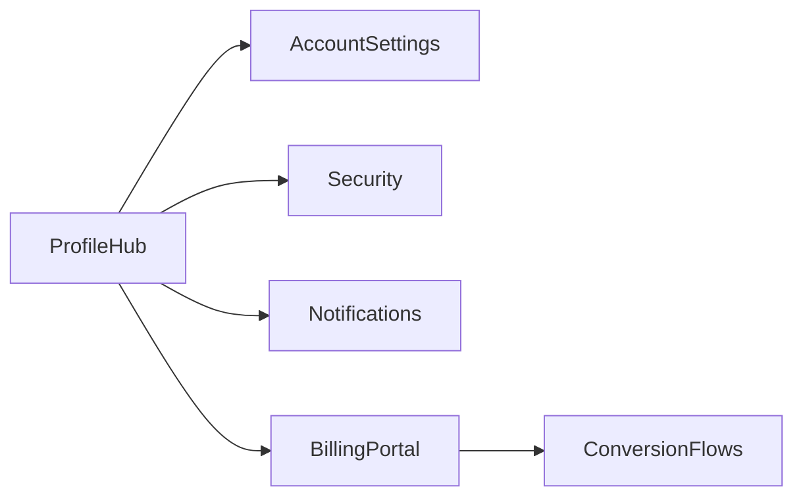

### 8.2 Author Profile Pages

```
Author Header
 Name / Portrait / Bio / Follow Button
 Stats: Published Stories, Worlds, Entities

Tabs:
  Stories | Worlds | Entities | Activity
```

- When viewing authorship links from resource modals, route here.
- Each tab reuses card grids scoped to that author.

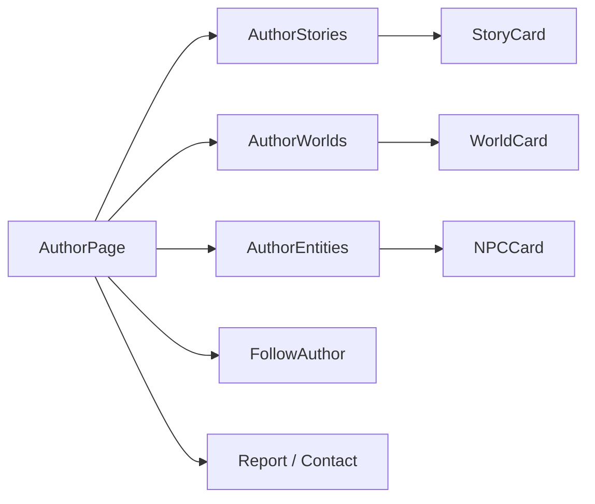

### 8.3 Conversion & Store Flows

```
┌────────── Stones / Subscription ──────────┐
│ Balance summary                           │
│ [Buy Stones]  [Upgrade Plan]              │
│ Packs grid (Small, Medium, Large)         │
│ Subscription tiers comparison             │
│ Payment method / billing history          │
└───────────────────────────────────────────┘
```

- Accessible via Profile hub and marketing CTAs.
- Supports promo codes, receipt download, gifting stones.

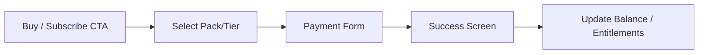

### 8.4 Other Potential Gaps

- **Notifications Center:** To surface approvals, compilation errors, subscription changes.
- **Admin Review Console:** Not yet designed; needed for approving Pending submissions.
- **Tutorial / Onboarding Flow:** Walk new authors through first world/story creation.
- **Searchable Lore Library:** Standalone view for authors to manage large lore sets.
- **Support / Help Center:** Quick link for reporting issues outside Manage modal.
