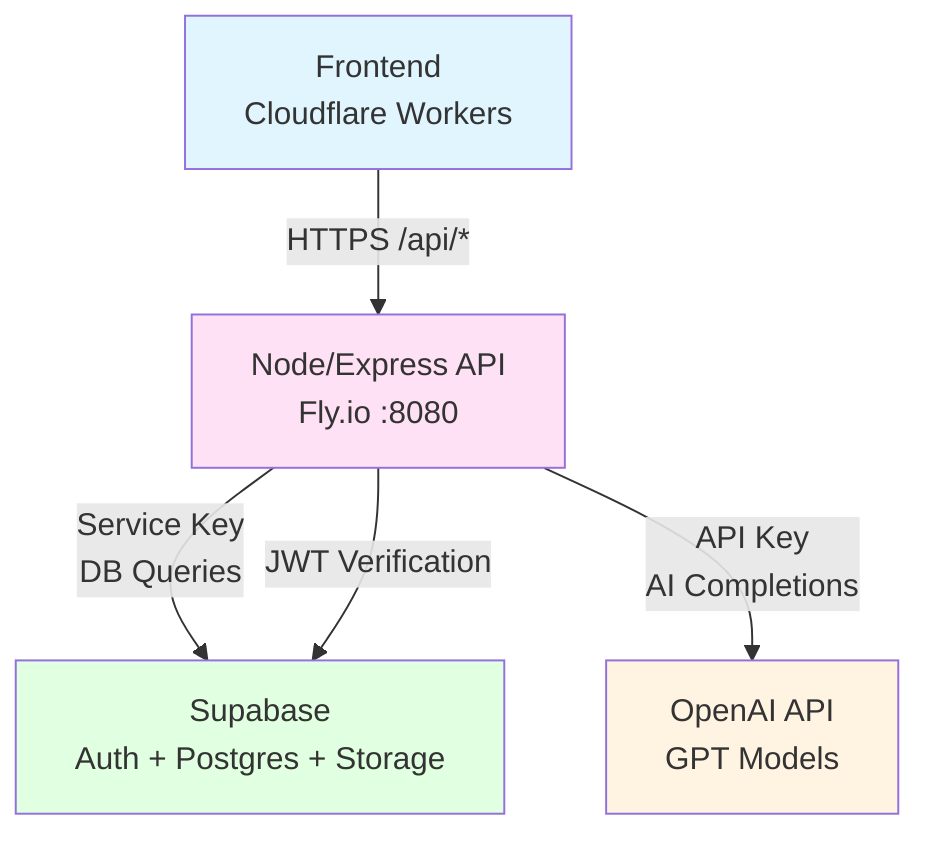
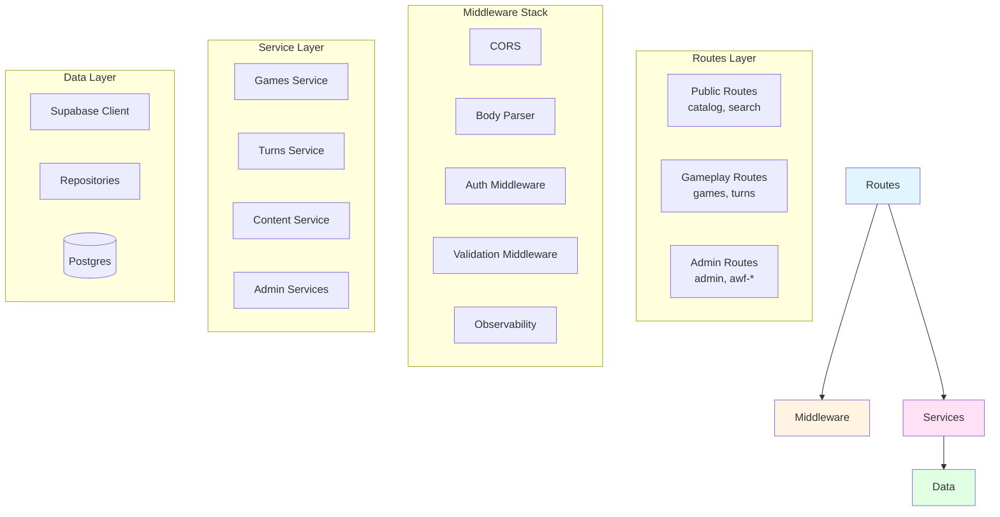
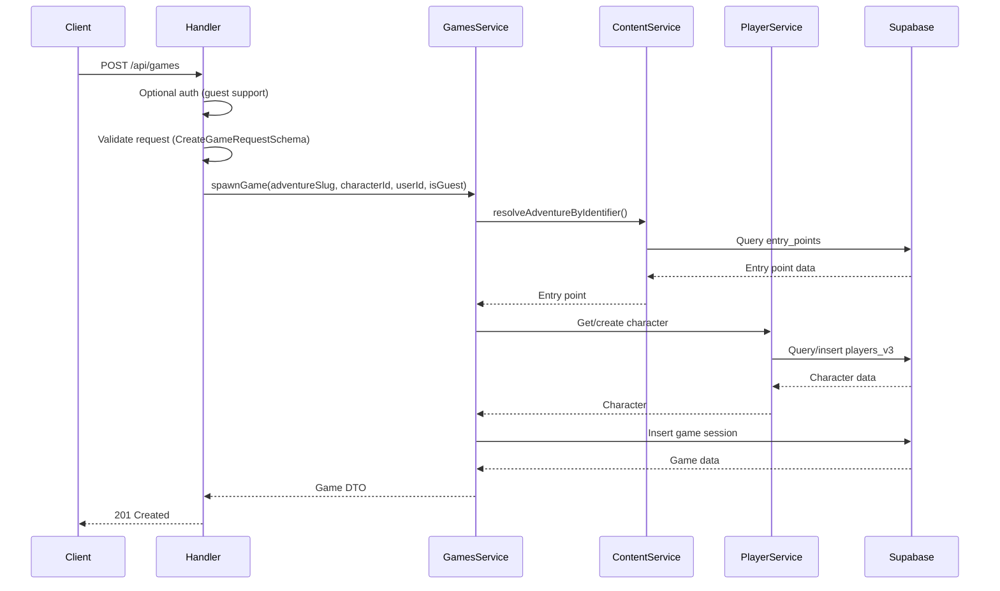
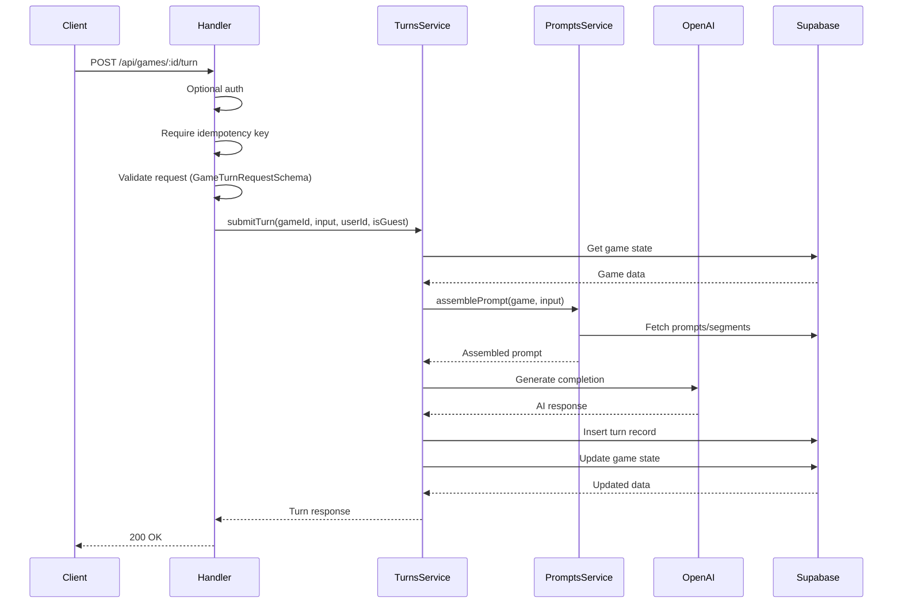
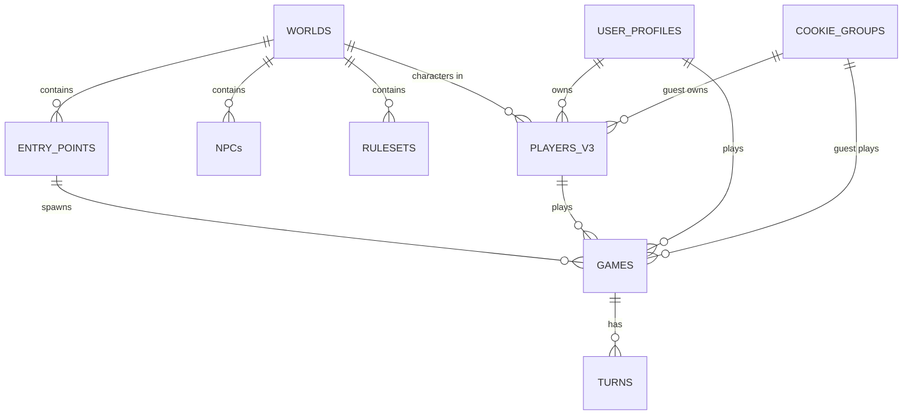

# Backend Architecture Map

## Executive Summary

Stone Caster backend is a Node.js/Express API server deployed on Fly.io, using Supabase for authentication, database, and storage. The API provides endpoints for game content (worlds, stories, NPCs, rulesets), gameplay (turns, sessions, character management), admin operations, and platform features (wallet, telemetry, subscriptions).

### What the Backend Does
The backend API handles:
- **Content Management**: CRUD operations for worlds, stories/entry points, NPCs, rulesets
- **Gameplay**: Game session creation, turn processing, state management
- **Character System**: Player/character creation and management (Player V3 schema)
- **Authentication**: JWT verification via Supabase, guest cookie support
- **Admin Operations**: Content moderation, AWF (Adventure World Framework) operations, analytics
- **Platform Features**: Wallet/stones, telemetry, subscriptions, webhooks

### Code Organization
The backend is structured as:
- **Monorepo workspace**: `backend/` package in npm workspace
- **Framework**: Express.js with TypeScript
- **Routes**: Modular routers in `routes/` directory
- **Services**: Business logic in `services/` directory
- **Repositories**: Data access layer in `repositories/` and `repos/`
- **Middleware**: Auth, validation, observability in `middleware/`
- **Shared Types**: Common types in `shared/` package

### Primary Request/Response Lifecycle

1. Request arrives → Express middleware stack processes (CORS, JSON parsing, cookies)
2. Observability middleware → Generates trace ID, creates logger, records start time
3. Route matching → Express router matches path to handler
4. Auth middleware (if required) → Verifies JWT via Supabase or extracts guest cookie
5. Validation middleware (if present) → Validates request body/params/query with Zod
6. Route handler → Calls service layer functions
7. Service layer → Business logic, calls repositories/data access
8. Repository/Data access → Queries Supabase (Postgres) or external APIs
9. Response formatting → Success/error response via `sendSuccess`/`sendErrorWithStatus`
10. Logging → Request metrics logged, telemetry recorded

---

## Bird's-Eye Diagrams

### System Architecture



### Backend Layer Architecture



---

## Definitions & Conventions

### App-Specific Terms

- **AWF (Adventure World Framework)**: Internal framework for world/story/NPC content structure
- **Entry Point**: Playable content (adventure, scenario, sandbox, quest) - replaces legacy "story" term
- **Core Contract**: AWF document defining world rules, tone, mechanics
- **Ruleset**: Game mechanics and rules (AWF ruleset schema)
- **Injection Map**: Configuration for injecting NPCs/scenarios into entry points
- **Bundle**: Assembled game content (world + entry points + NPCs + rulesets) for gameplay
- **Turn**: Single interaction in a game (user input → AI response → state update)
- **Session**: Game session tied to entry point, character, and user/guest
- **Stones**: Virtual currency for gameplay actions
- **Player V3**: Latest character schema (independent of adventures, normalized identity)

### Naming Conventions

- **Routes**: kebab-case files (e.g., `players-v3.ts`, `awf-sim-admin.ts`)
- **Services**: camelCase, suffix `Service` (e.g., `games.service.ts`, `turns.service.ts`)
- **Repositories**: camelCase, suffix `Repository` or `-repo.ts`
- **Middleware**: camelCase (e.g., `auth.ts`, `validation.ts`)
- **Route Handlers**: Express route definitions with HTTP method (get, post, put, patch, delete)
- **API Endpoints**: `/api/{resource}` prefix, kebab-case paths

### Exceptions

- AWF admin routes use `awf-*` prefix (e.g., `awf-sim-admin.ts`)
- Legacy routes may not follow conventions (e.g., `story.ts` instead of `stories.ts`)
- Some services use alternate naming (e.g., `preview.ts` instead of `preview.service.ts`)

---

## Server Entry & Deployment

### Main Entry File

**Entry**: [`backend/src/index.ts`](../backend/src/index.ts)

**Bootstrap Process:**
1. Environment loading via `config/load-env.ts`
2. Config service initialization (`configService`)
3. Express app creation
4. Middleware registration (CORS, body parser, cookies, observability)
5. Route registration (all `/api/*` routes)
6. Error handler registration
7. Server listening on configured port (default 8080)

### Deployment Configuration

**Fly.io Configuration**: [`fly.toml`](../fly.toml)
- **App Name**: `stonecaster-api`
- **Primary Region**: `iad` (US East)
- **Port**: `8080` (internal)
- **Health Check**: `GET /health` (10s interval)
- **Process Model**: Single process `app`
- **Auto-scaling**: `min_machines_running = 1`, `auto_stop_machines = false`

**Environment Variables** (required):
- `SUPABASE_URL` - Supabase project URL
- `SUPABASE_ANON_KEY` - Supabase anonymous key
- `SUPABASE_SERVICE_KEY` - Supabase service role key (bypasses RLS)
- `OPENAI_API_KEY` - OpenAI API key for AI completions
- `PRIMARY_AI_MODEL` - OpenAI model identifier
- `PORT` - Server port (default 8080)
- `NODE_ENV` - Environment (development/production/test)
- `CORS_ORIGIN` - Allowed frontend origin
- `FRONTEND_URL` - Frontend URL for redirects
- `API_URL` - Backend API URL
- `API_JSON_BODY_LIMIT` - JSON body size limit (default 1mb)

### Process Model

- **Concurrency**: Single-threaded Node.js event loop
- **Scaling**: Fly.io handles horizontal scaling based on traffic
- **Health Checks**: HTTP health check at `/health` endpoint
- **Graceful Shutdown**: Standard Express shutdown (no custom handling)

---

## Routing & Middleware Stack

### Global Middleware Order

Applied to all requests in [`backend/src/index.ts`](../backend/src/index.ts):

1. **CORS** - Cross-origin resource sharing (allows configured origins, credentials enabled)
2. **JSON Body Parser** - Parses JSON bodies (limit: `API_JSON_BODY_LIMIT` or 1mb)
3. **URL Encoded Parser** - Parses form data (extended: true)
4. **Cookie Parser** - Parses cookies (for guest IDs)
5. **Observability Middleware** - Generates trace ID, creates logger, records start time

### Route-Level Middleware

Common middleware applied per-route:

| Middleware | File | Purpose | Usage |
|------------|------|---------|-------|
| `authenticateToken` | `middleware/auth.ts` | JWT verification | Protected routes |
| `optionalAuth` | `middleware/auth.ts` | JWT or guest cookie | Public routes with user context |
| `requireAdminRole` | `routes/admin.ts` | Admin role check | Admin routes |
| `requireIdempotencyKey` | `middleware/validation.ts` | Idempotency header | Turn submission |
| `validateRequest` | `middleware/validation.ts` | Zod schema validation | Request validation |

### Route Registration

All routes registered in [`backend/src/index.ts`](../backend/src/index.ts):

| Base Path | Router File | Auth | Notes |
|-----------|------------|------|-------|
| `/api/config` | `routes/config.ts` | None | Config endpoints |
| `/api/me` | `routes/me.ts` | Optional | Current user info |
| `/api/profile` | `routes/profile.ts` | Optional | User profile |
| `/api/characters` | `routes/characters.ts` | Optional | Character CRUD |
| `/api/players-v3` | `routes/players-v3.ts` | Optional | Player V3 CRUD |
| `/api/premades` | `routes/premade-characters.ts` | Optional | Premade characters |
| `/api/games` | `routes/games.ts` | Optional | Game sessions |
| `/api/worlds` | `routes/worlds.ts` | Public | World catalog |
| `/api/catalog` | `routes/catalog.ts` | Public | Unified catalog |
| `/api/content` | `routes/content.ts` | Optional | Content operations |
| `/api/adventures` | `routes/adventures.ts` | Optional | Legacy adventures |
| `/api/search` | `routes/search.ts` | Public | Search endpoints |
| `/api/stones` | `routes/stones.ts` | Optional | Stone/wallet operations |
| `/api/subscription` | `routes/subscription.ts` | Protected | Subscription management |
| `/api/telemetry` | `routes/telemetry.ts` | Optional | Telemetry events |
| `/api/story` | `routes/story.ts` | Optional | Legacy story actions |
| `/api/dice` | `routes/dice.ts` | Optional | Dice rolling |
| `/api/webhooks` | `routes/webhooks.ts` | Public | Webhook handlers |
| `/api/cookie-linking` | `routes/cookie-linking.ts` | Optional | Guest-to-user linking |
| `/api/auth` | `routes/auth.ts` | Public | Auth operations |
| `/api/debug` | `routes/debug.ts` | None | Debug endpoints (dev only) |
| `/api/admin` | `routes/admin.ts` | Admin | Admin CRUD operations |
| `/api/player` | `routes/player.ts` | Optional | Player operations |
| `/api/admin/metrics` | `routes/admin/metrics.ts` | Admin | Admin metrics |

### AWF Admin Routes

Special AWF admin routes (all require admin role):

| Base Path | Router File | Purpose |
|-----------|------------|---------|
| `/api/admin/awf/core-contracts` | `routes/admin.ts` | Core contract management |
| `/api/admin/awf/core-rulesets` | `routes/admin.ts` | Core ruleset management |
| `/api/admin/awf/worlds` | `routes/admin.ts` | AWF world documents |
| `/api/admin/awf/adventures` | `routes/admin.ts` | AWF adventure documents |
| `/api/admin/awf/adventure-starts` | `routes/admin.ts` | Adventure start configs |
| `/api/admin/awf/rulesets` | `routes/admin.ts` | AWF ruleset documents |
| `/api/admin/awf/npcs` | `routes/admin.ts` | AWF NPC documents |
| `/api/admin/awf/scenarios` | `routes/admin.ts` | AWF scenario documents |
| `/api/admin/awf/injection-maps` | `routes/admin.ts` | Injection map management |
| `/api/admin/awf/quest-graph` | `routes/awf-quest-graph-admin.ts` | Quest graph operations |
| `/api/admin/awf/npc-personality` | `routes/awf-npc-personality-admin.ts` | NPC personality system |
| `/api/admin/awf/mechanics` | `routes/awf-mechanics-admin.ts` | Game mechanics |
| `/api/admin/awf/marketplace` | `routes/awf-marketplace.ts` | Marketplace operations |
| `/api/admin/awf/localization` | `routes/awf-localization-admin.ts` | Localization/i18n |
| `/api/admin/awf/liveops` | `routes/awf-liveops.ts` | Live operations config |
| `/api/admin/awf/experiments` | `routes/awf-experiments-admin.ts` | A/B testing |
| `/api/admin/awf/economy` | `routes/awf-economy-admin.ts` | Economy/wallet operations |
| `/api/admin/awf/autoplay` | `routes/awf-autoplay.ts` | Autoplay/bot testing |
| `/api/admin/awf/sim` | `routes/awf-sim-admin.ts` | Simulation operations |
| `/api/admin/awf/ops` | `routes/awf-ops-admin.ts` | Operations/rate limiting |
| `/api/admin/awf/metrics` | `routes/awf-metrics-admin.ts` | Metrics/analytics |
| `/api/admin/awf/cloud-sync` | `routes/awf-cloud-sync.ts` | Cloud sync operations |
| `/api/admin/awf/session-ops` | `routes/awf-session-ops.ts` | Session operations |
| `/api/admin/awf/party` | `routes/awf-party-admin.ts` | Party/group management |

---

## Endpoint → Handler → Service → Data Map

### Critical Endpoints

#### GET /api/catalog/worlds

**Handler**: [`routes/catalog.ts:20`](../backend/src/routes/catalog.ts#L20)
**Service**: Direct Supabase query
**Data Flow:**
```
Request → Query validation (Zod) → Supabase query (worlds table) → Transform to DTO → Response
```

**Data Model**: `worlds` table (id, name, slug, description, status, version, doc)

#### GET /api/catalog/entry-points

**Handler**: [`routes/catalog.ts:448`](../backend/src/routes/catalog.ts#L448)
**Service**: `ContentService.getEntryPoints()`
**Data Flow:**
```
Request → ContentService → Supabase query (entry_points table) → Transform to DTO → Response
```

**Data Model**: `entry_points` table (id, type, world_id, title, description, doc, status)

#### POST /api/games

**Handler**: [`routes/games.ts:67`](../backend/src/routes/games.ts#L67)
**Service**: `GamesService.spawnGame()`
**Data Flow:**


**Data Model**: 
- Input: `{ adventureSlug, characterId }`
- Output: `GameDTO` with game session data
- Tables: `games`, `entry_points`, `players_v3`

#### POST /api/games/:id/turn

**Handler**: [`routes/games.ts:238`](../backend/src/routes/games.ts#L238)
**Service**: `turnsService.submitTurn()`
**Data Flow:**


**Data Model**:
- Input: `{ input, idempotencyKey }`
- Output: `TurnResponse` with AI response and updated state
- Tables: `turns`, `games`, `prompts`, `prompt_segments`

#### POST /api/players-v3

**Handler**: [`routes/players-v3.ts:142`](../backend/src/routes/players-v3.ts#L142)
**Service**: `PlayerV3Service.createPlayer()`
**Data Flow:**
```
Request → Optional auth → Validation → PlayerV3Service → Supabase insert (players_v3) → Response
```

**Data Model**: `players_v3` table (id, world_slug, user_id, cookie_group_id, doc, created_at)

---

## Data Layer & Supabase Integration

### Supabase Client Configuration

**Service**: [`backend/src/services/supabase.ts`](../backend/src/services/supabase.ts)

Two clients:
- **`supabase`**: Anonymous key client (respects RLS)
- **`supabaseAdmin`**: Service key client (bypasses RLS for admin operations)

### Database Tables

Primary tables used:

| Table | Purpose | Key Fields |
|-------|---------|------------|
| `worlds` | Game worlds/settings | id, name, slug, status, doc (JSONB) |
| `entry_points` | Playable content (adventures/scenarios) | id, type, world_id, title, doc, status |
| `players_v3` | Character data | id, world_slug, user_id, cookie_group_id, doc |
| `games` | Active game sessions | id, entry_point_id, character_id, user_id, state_snapshot |
| `turns` | Turn history | id, game_id, input, response, turn_index |
| `npcs` | NPC definitions | id, world_id, name, doc (JSONB) |
| `rulesets` | Game rules | id, world_id, name, doc (JSONB) |
| `prompts` | AI prompt templates | id, content, metadata, layer |
| `prompt_segments` | Prompt building blocks | id, prompt_id, content, order |
| `stone_ledger` | Stone transactions | id, user_id, amount, reason, created_at |
| `cookie_groups` | Guest user groups | id, cookie_id, user_id (when linked) |
| `user_profiles` | User metadata | id, user_id, role, preferences |

### Entity Relationship Diagram



### RPC Functions

Supabase RPC functions used (verify in Supabase dashboard):
- None explicitly called in current codebase (direct table queries used)
- Potential RPC functions may exist for complex queries (check Supabase migrations)

### Row Level Security (RLS)

RLS policies enforced in Supabase:
- Users can only access their own data (games, characters, profiles)
- Public read access for worlds, entry_points, npcs, rulesets (status='active')
- Admin operations bypass RLS via service key client

**RLS Context**: User ID extracted from JWT or guest cookie ID

---

## AuthN/AuthZ

### Authentication Flow

**Middleware**: [`backend/src/middleware/auth.ts`](../backend/src/middleware/auth.ts)

1. **JWT Auth** (`authenticateToken`):
   - Extract `Authorization: Bearer <token>` header
   - Verify token with Supabase `auth.getUser()`
   - Set `req.ctx.userId` and `req.ctx.isGuest = false`

2. **Optional Auth** (`optionalAuth`):
   - Try JWT auth first
   - Fallback to guest cookie (`guestId` cookie or `x-guest-cookie-id` header)
   - If no auth, create guest ID and set cookie
   - Set `req.ctx.userId` and `req.ctx.isGuest`

3. **Guest Cookie**:
   - Cookie name: `guestId`
   - Header: `x-guest-cookie-id`
   - UUID format
   - Max age: 1 year

### Authorization

**Role-Based Access Control:**

- **Admin Role**: `requireAdminRole` middleware
  - Checks `user.user_metadata.role === 'prompt_admin'`
  - Used in `/api/admin/*` routes
  
- **Role Types** (from user_metadata):
  - `prompt_admin` - Full admin access
  - `moderator` - Content moderation
  - `creator` - Content creation
  - `admin` - General admin (may overlap with prompt_admin)

**Feature Flags:**
- `featureFlags.service.ts` - Feature flag checks (not widely used yet)
- Flags checked in service layer, not middleware

**Entitlement Checks:**
- Subscription checks in `subscription.service.ts`
- Stone balance checks in `stones.service.ts`
- Rate limiting in `rateLimit.service.ts`

---

## Validation, Errors, and Observability

### Validation

**Middleware**: [`backend/src/middleware/validation.ts`](../backend/src/middleware/validation.ts)

- **Framework**: Zod schemas
- **Validation Points**:
  - Request body: `validateRequest(schema, 'body')`
  - URL params: `validateRequest(schema, 'params')`
  - Query params: `validateRequest(schema, 'query')`
- **Error Format**: `{ field, message, code }` array in error response

**Common Schemas** (from `@shared`):
- `CreateGameRequestSchema` - Game creation
- `GameTurnRequestSchema` - Turn submission
- `IdParamSchema` - UUID path params
- `PlayerV3Schema` - Character data

### Error Handling

**Error Response Format**: [`backend/src/utils/response.ts`](../backend/src/utils/response.ts)

Standardized error responses:
```typescript
{
  ok: false,
  error: {
    code: ApiErrorCode,
    message: string,
    details?: unknown
  }
}
```

**Error Codes** (from `@shared/types/api.ts`):
- `VALIDATION_FAILED` - Request validation error
- `UNAUTHORIZED` - Auth required
- `FORBIDDEN` - Insufficient permissions
- `NOT_FOUND` - Resource not found
- `INTERNAL_ERROR` - Server error
- `RATE_LIMITED` - Too many requests
- `IDEMPOTENCY_CONFLICT` - Duplicate request

**Error Handler**: Global error handler in [`backend/src/index.ts:133`](../backend/src/index.ts#L133)
- Catches unhandled errors
- Returns 500 with generic error message
- Logs error details

### Observability

**Middleware**: [`backend/src/middleware/observability.ts`](../backend/src/middleware/observability.ts)

**Features:**
- **Trace ID**: Generated per request, added to response header `X-Trace-Id`
- **Structured Logging**: `LoggerService` with trace context
- **Request Metrics**: Start time, latency, status code
- **Telemetry**: Events sent to `TelemetryService`

**Services:**
- `LoggerService` - Structured logging with trace IDs
- `MetricsService` - Metrics collection (latency, errors, etc.)
- `TelemetryService` - Event telemetry to Supabase

**Logging Libraries:**
- Console logging (structured format)
- Trace ID propagation
- Request/response logging

**Tracing:**
- No distributed tracing (OpenTelemetry) currently
- Trace IDs local to single request

**Metrics:**
- Request latency
- Error rates
- Turn submission counts
- Game session metrics

### Rate Limiting

**Service**: [`backend/src/services/rateLimit.service.ts`](../backend/src/services/rateLimit.service.ts)

- Rate limits stored in Supabase
- Per-user/per-endpoint limits
- Not enforced globally (per-route if needed)

### Caching

- **No caching layer** currently
- React Query handles frontend caching
- Consider Redis for backend caching if needed

### Queues/Crons

- **Jobs**: `backend/jobs/` directory
  - `awf-analytics-rollup.ts` - Analytics rollup job
  - `awf-migration-audit.ts` - Migration audit
- **Scheduling**: Not configured (run manually or via external scheduler)
- **No queue system** (consider adding for async operations)

---

## Unused/Orphaned Handlers & Modules

### Handlers Not Registered in Routers

| Handler | Path | Reason | Recommendation |
|---------|------|--------|---------------|
| None identified | - | All route files export default router | Verify all routers imported in `index.ts` |

**Verification**: All route files in `routes/` export default router and are imported in [`backend/src/index.ts`](../backend/src/index.ts)

### Services Not Referenced by Handlers

| Service | Path | Used By | Status |
|---------|------|---------|--------|
| `prompts.service.clean.ts` | `services/prompts.service.clean.ts` | Unknown | May be alternative/backup - verify |
| Various AWF services | `services/awf-*.ts` | AWF admin routes | Used by AWF admin handlers |

**Note**: Many AWF services may be used indirectly through admin routes - need deeper analysis.

### Scripts/Jobs Not Referenced by Schedulers

| Script/Job | Path | Scheduled? | Recommendation |
|------------|------|------------|----------------|
| `awf-analytics-rollup.ts` | `jobs/awf-analytics-rollup.ts` | No | Add to cron or document manual execution |
| `awf-migration-audit.ts` | `jobs/awf-migration-audit.ts` | No | Add to cron or document manual execution |

### Repositories/Modules Not Used

| Module | Path | Used By | Status |
|--------|------|---------|--------|
| `repos/quest-graphs-repo.ts` | `repos/quest-graphs-repo.ts` | `routes/awf-quest-graph-admin.ts` | Used |
| Various `awf-*` modules | `*/awf-*.ts` | AWF admin routes | Used by admin |

**Note**: Static analysis needed to verify all imports are used. Run dependency analysis tool.

---

## Operational Notes

### Required Environment Variables

| Variable | Purpose | Required | Default |
|----------|---------|----------|---------|
| `SUPABASE_URL` | Supabase project URL | Yes | - |
| `SUPABASE_ANON_KEY` | Supabase anonymous key | Yes | - |
| `SUPABASE_SERVICE_KEY` | Supabase service key | Yes | - |
| `OPENAI_API_KEY` | OpenAI API key | Yes | - |
| `PRIMARY_AI_MODEL` | OpenAI model | Yes | - |
| `PORT` | Server port | No | 8080 |
| `NODE_ENV` | Environment | No | development |
| `CORS_ORIGIN` | Allowed origin | No | - |
| `FRONTEND_URL` | Frontend URL | No | - |
| `API_URL` | API URL | No | - |
| `API_JSON_BODY_LIMIT` | JSON limit | No | 1mb |

**Secrets Provider**: Environment variables (no external secrets manager)

**Where Read**: [`backend/src/config/load-env.ts`](../backend/src/config/load-env.ts) and [`backend/src/services/config.service.ts`](../backend/src/services/config.service.ts)

### Release Checklist

When endpoints change:

1. ✅ Update Swagger docs (`config/swagger.ts`)
2. ✅ Update Zod schemas in `@shared`
3. ✅ Update frontend API client
4. ✅ Add/update tests
5. ✅ Update rate limits if needed
6. ✅ Verify RLS policies if new tables
7. ✅ Update this documentation
8. ✅ Test in staging environment
9. ✅ Monitor error rates after deploy

### Backward Compatibility

**Breaking Changes:**
- Changing request/response schemas
- Removing endpoints
- Changing auth requirements

**Non-Breaking Patterns:**
- Adding optional fields to requests
- Adding new endpoints
- Adding new optional query params
- Extending response DTOs with new fields

**Versioning:**
- No API versioning currently (`/api/v1` etc.)
- Consider versioning for major changes

---

## Appendix

### Full Endpoint Index

**Public Endpoints:**
- `GET /api/catalog/worlds`
- `GET /api/catalog/worlds/:idOrSlug`
- `GET /api/catalog/stories`
- `GET /api/catalog/stories/:idOrSlug`
- `GET /api/catalog/npcs`
- `GET /api/catalog/npcs/:id`
- `GET /api/catalog/rulesets`
- `GET /api/catalog/rulesets/:id`
- `GET /api/catalog/entry-points`
- `GET /api/catalog/entry-points/:idOrSlug`
- `GET /api/search/*`
- `GET /api/worlds`
- `GET /api/config`
- `GET /api/health`
- `POST /api/auth/*`
- `POST /api/webhooks/*`

**Optional Auth Endpoints:**
- `POST /api/games`
- `GET /api/games/:id`
- `GET /api/games`
- `POST /api/games/:id/turn`
- `GET /api/games/:id/turns`
- `GET /api/games/:id/session-turns`
- `GET /api/players-v3/:id`
- `PATCH /api/players-v3/:id`
- `GET /api/players-v3/world/:worldSlug`
- `POST /api/players-v3`
- `GET /api/me`
- `GET /api/profile`
- `PATCH /api/profile`
- `POST /api/story`
- `POST /api/dice`
- `POST /api/telemetry`
- `GET /api/telemetry/stats`
- `POST /api/stones/*`
- `GET /api/stones/*`

**Protected Endpoints:**
- `GET /api/subscription/*`
- `POST /api/subscription/*`
- `PATCH /api/subscription/*`

**Admin Endpoints:**
- All `/api/admin/*` routes (see [AWF Admin Routes](#awf-admin-routes) section)

### Module Index

**Handlers** (`routes/`):
- `admin.ts` - Main admin routes
- `catalog.ts` - Catalog endpoints
- `games.ts` - Game sessions
- `players-v3.ts` - Player V3 CRUD
- `characters.ts` - Character operations
- `story.ts` - Legacy story actions
- `worlds.ts` - World operations
- `auth.ts` - Authentication
- `telemetry.ts` - Telemetry
- `stones.ts` - Stone/wallet
- `subscription.ts` - Subscriptions
- `webhooks.ts` - Webhooks
- `awf-*.ts` - AWF admin routes

**Services** (`services/`):
- `games.service.ts` - Game session logic
- `turns.service.ts` - Turn processing
- `prompts.service.ts` - Prompt assembly
- `content.service.ts` - Content operations
- `characters.service.ts` - Character logic
- `player-v3.service.ts` - Player V3 logic
- `wallet.service.ts` - Wallet operations
- `telemetry.service.ts` - Telemetry
- `config.service.ts` - Configuration
- Various AWF services

**Repositories** (`repositories/`, `repos/`):
- `awf-*-repository.ts` - AWF data access
- `quest-graphs-repo.ts` - Quest graphs
- Various repository patterns

**Middleware** (`middleware/`):
- `auth.ts` - Authentication
- `validation.ts` - Request validation
- `observability.ts` - Logging/metrics
- `adminAuth.ts` - Admin auth checks

### Methodology

**How This Doc Was Compiled:**

1. **Static Analysis**: Read route files to extract endpoint definitions
2. **Import Tracing**: Followed imports from routes → services → repositories
3. **Code Search**: Used grep to find Supabase table references
4. **Manual Review**: Examined key files for data flow

**Limitations:**
- Dynamic imports not analyzed
- String-based route registration not checked (all routes explicit)
- Service usage may be indirect (need deeper dependency analysis)

**Verification Steps:**

1. **Route Registration**: Check `backend/src/index.ts` for all `app.use()` calls
2. **Handler Usage**: Verify all exported routers are imported
3. **Service Usage**: Use dependency-cruiser to build service dependency graph
4. **Table References**: Search for `.from('table_name')` to find all table usages
5. **RPC Functions**: Check Supabase dashboard for RPC functions

---

## Suggested Automation

### Tools for Regenerating This Document

1. **Route Analysis:**
   - Parse `backend/src/index.ts` to extract route registrations
   - Parse route files to extract HTTP method + path combinations
   - Map routes to handlers → services → repositories

2. **Dependency Graph:**
   - `dependency-cruiser` - Build import dependency graph
   - Command: `npx dependency-cruiser --config .dependency-cruiser.json backend/src`

3. **Endpoint Discovery:**
   - AST walker (TypeScript compiler API) to find `router.get/post/put/patch/delete()` calls
   - Extract path patterns and middleware chains

4. **Table Reference Analysis:**
   - Regex search for `.from('table_name')` patterns
   - Build table usage map

5. **Unused Module Detection:**
   - `ts-prune` or `unimported` - Find unused exports
   - Combine with import graph to identify orphaned modules

### Suggested npm Script

Add to `backend/package.json`:
```json
{
  "scripts": {
    "docs:arch": "npm run docs:arch:routes && npm run docs:arch:deps && npm run docs:arch:tables",
    "docs:arch:routes": "tsx scripts/generate-endpoint-map.ts",
    "docs:arch:deps": "dependency-cruiser --config .dependency-cruiser.json --output-type json src > docs/architecture/deps.json",
    "docs:arch:tables": "grep -r \"\\.from(['\\\"]\" src --include=\"*.ts\" | sed 's/.*\\.from([\"'']//' | sed 's/[\"'']).*/' | sort -u > docs/architecture/tables.txt"
  }
}
```

### Tool Recommendations

- **dependency-cruiser**: Import graph visualization
- **ts-morph**: TypeScript AST manipulation for route/endpoint analysis
- **ts-prune**: Find unused exports
- **swagger-jsdoc**: Generate Swagger from JSDoc (already partially used)
- **express-list-endpoints**: List all Express routes (npm package)


