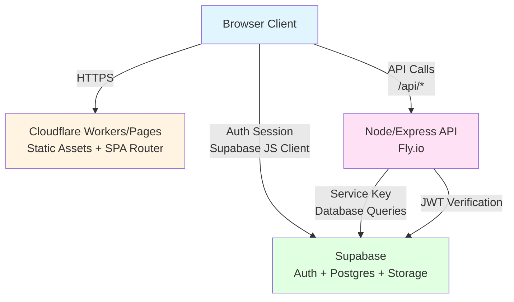
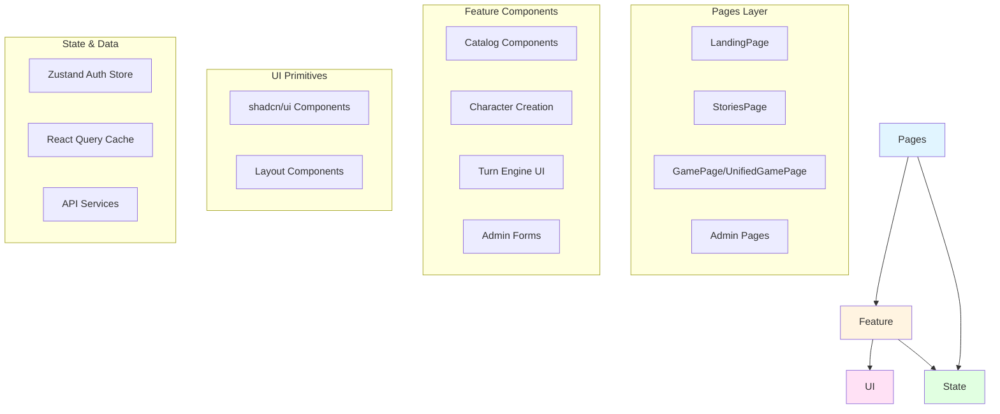
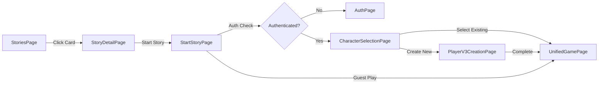

# Frontend Architecture Map

## Executive Summary

Stone Caster is an AI-driven role-playing game platform with a React/Vite frontend deployed on Cloudflare Workers/Pages. The frontend is a client-side rendered (CSR) single-page application that communicates with a Node/Express API backend on Fly.io. Authentication and database operations are handled through Supabase.

### What the App Does
Stone Caster enables users to:
- Browse and discover game worlds, stories (entry points), NPCs, and rulesets through a catalog interface
- Create characters and start interactive story-driven adventures
- Play turn-based narrative adventures powered by AI
- Manage profiles, wallet, and subscriptions (authenticated users)
- Administer content, users, and system configuration (admin users)

### Code Organization
The frontend is structured as:
- **Monorepo workspace**: `frontend/` package in a npm workspace
- **Routing**: React Router v6 with declarative route definitions in `App.tsx`
- **State Management**: Zustand for auth, React Query for server state
- **UI Components**: shadcn/ui component library with Tailwind CSS
- **Feature Shells**: Page-level components in `pages/`, feature-specific components in `components/`
- **Services**: API client layer in `services/`, utilities in `lib/` and `utils/`

### Primary Request/Response Lifecycle

1. User navigates → React Router matches route → Page component renders
2. Page component uses React Query hooks → Calls API service functions
3. Service functions use `apiFetch()` → HTTP requests to backend API (`/api/*`)
4. Backend responds with JSON → React Query caches and updates UI
5. Auth state managed via Zustand store → Checks Supabase session on mount
6. Protected routes use `ProtectedRoute` wrapper → Redirects to `/auth` if unauthenticated
7. Guest users identified via `guestId` cookie → Passed in `x-guest-cookie-id` header
8. Error boundaries catch runtime errors → Display error UI
9. Toast notifications for user feedback → Sonner toast provider
10. Admin routes use role-based guards → Redirects based on user role metadata

---

## Bird's-Eye Diagrams

### System Architecture



### Frontend Layer Architecture



---

## Definitions & Conventions

### App-Specific Terms

- **World**: A game setting/universe (e.g., "Mystika") containing stories, NPCs, and rules
- **Story/Entry Point**: A playable adventure or scenario within a world; can be type `adventure`, `scenario`, `sandbox`, or `quest`
- **Ruleset**: Game mechanics and rules that govern a world or story
- **Entry**: Legacy term for story/entry point (being phased out in favor of "entry_point")
- **NPC**: Non-player character with personality, dialogue, and behavior data
- **Player/Character**: User-created character data (Player V3 schema) used in gameplay
- **Game**: Active game session tied to an entry point, character, and world
- **Turn**: Single interaction in a game (user input → AI response → state update)
- **Stones**: Virtual currency for gameplay actions (turn submissions, premium features)

### Naming Conventions

- **Pages**: PascalCase, suffix `Page` (e.g., `LandingPage.tsx`, `WorldDetailPage.tsx`)
- **Components**: PascalCase, descriptive names (e.g., `CharacterCreator`, `PromptApprovalModal`)
- **Hooks**: camelCase, prefix `use` (e.g., `useCatalog`, `useStartAdventure`)
- **Services**: camelCase, suffix `Service` (e.g., `authService`, `characterService`)
- **Routes**: kebab-case paths (e.g., `/character-creator`, `/play/:gameId`)
- **File Organization**: 
  - Pages in `pages/` with subfolders by domain (`stories/`, `worlds/`, `admin/`)
  - Components in `components/` grouped by feature (`catalog/`, `character/`, `gameplay/`)
  - UI primitives in `components/ui/`
  - Services in `services/`
  - Hooks in `hooks/`

### Exceptions

- Admin routes use nested structure: `admin/entry-points/index.tsx`, `admin/worlds/[id].tsx`
- Legacy pages may be in root `pages/` (e.g., `AdventuresPage.tsx`, `MyAdventuresPage.tsx`)
- Shared types in `types/` folder
- Test utilities in `test/` and `tests/`

---

## Routing Overview

### Route Definitions

All routes are defined in [`frontend/src/App.tsx`](../frontend/src/App.tsx) using React Router `<Routes>` and `<Route>` components.

| Path | Component | Auth | Render Mode | Notes |
|------|-----------|------|-------------|-------|
| `/` | `LandingPage` | Public | CSR | Homepage with featured content |
| `/stories` | `StoriesPage` | Public | CSR | Catalog of all stories/entry points |
| `/stories/:id` | `StoryDetailPage` | Public | CSR | Story details and start flow |
| `/play/start` | `StartStoryPage` | Optional | CSR | Entry point for starting stories |
| `/stories/:storyId/characters` | `CharacterSelectionPage` | Optional | CSR | Character selection for story |
| `/stories/:storyId/create-character` | `PlayerV3CreationPage` | Optional | CSR | Create new character |
| `/worlds` | `WorldsPage` | Public | CSR | Catalog of all worlds |
| `/worlds/:slug` | `WorldDetailPage` | Public | CSR | World details |
| `/npcs` | `NPCsPage` | Public | CSR | NPC catalog |
| `/npcs/:id` | `NPCDetailPage` | Public | CSR | NPC details |
| `/rulesets` | `RulesetsPage` | Public | CSR | Ruleset catalog |
| `/rulesets/:id` | `RulesetDetailPage` | Public | CSR | Ruleset details |
| `/character-creation` | `CharacterSelectionPage` | Optional | CSR | Legacy character creation |
| `/character-creator` | `CharacterCreatorPage` | Optional | CSR | Character creator wizard |
| `/wallet` | `WalletPage` | Protected | CSR | User wallet and stone balance |
| `/payments` | `PaymentsPage` | Protected | CSR | Payment/subscription management |
| `/profile` | `ProfilePage` | Protected | CSR | User profile settings |
| `/support` | `SupportPage` | Public | CSR | FAQ/support page |
| `/scenarios` | `ScenarioPicker` | Protected | CSR | Scenario selection for players |
| `/game/:id` | `GamePage` | Optional | CSR | Legacy game page |
| `/play/:gameId` | `UnifiedGamePage` | Optional | CSR | Primary game interface |
| `/unified-game/:id` | `UnifiedGamePage` | Optional | CSR | Alias for game interface |
| `/auth` | `AuthPage` | Public | CSR | Auth page (sign in/up) |
| `/auth/signin` | `AuthPage` (mode="signin") | Public | CSR | Sign in form |
| `/auth/signup` | `AuthPage` (mode="signup") | Public | CSR | Sign up form |
| `/auth/success` | `AuthSuccessPage` | Public | CSR | OAuth callback handler |
| `/admin/*` | `AppAdminShell` | Protected (Admin) | CSR | Admin panel (nested routes) |
| `*` | `NotFoundPage` | Public | CSR | 404 handler |

**Render Mode Notes:**
- All routes are Client-Side Rendered (CSR) - no SSR/SSG
- No edge/runtime distinction - all routes run in browser
- Admin routes use nested router (`/admin/*` → `AdminRoutes` component)

### Admin Routes (Nested)

Admin routes are defined in [`frontend/src/admin/AdminRoutes.tsx`](../frontend/src/admin/AdminRoutes.tsx):

| Path | Component | Roles | Notes |
|------|-----------|-------|-------|
| `/admin` | `AdminHome` | All authenticated | Admin dashboard |
| `/admin/entry-points` | `EntryPointsAdmin` | All authenticated | Entry points list |
| `/admin/entry-points/:id` | `EntryPointEditPage` | All authenticated | Entry point editor |
| `/admin/prompt-segments` | `PromptSegmentsAdmin` | All authenticated | Prompt segments management |
| `/admin/npcs` | `NPCsAdmin` | All authenticated | NPCs list |
| `/admin/npcs/new` | `CreateNPCPage` | All authenticated | Create NPC |
| `/admin/npcs/:id` | `NPCDetailPage` | All authenticated | NPC details |
| `/admin/npcs/:id/edit` | `EditNPCPage` | All authenticated | Edit NPC |
| `/admin/entries` | `EntriesAdmin` | creator, moderator, admin | Entries list |
| `/admin/entries/:id/edit` | `EntryEditPage` | creator, moderator, admin | Edit entry |
| `/admin/entries/:id/preview` | `EntryPreviewPage` | creator, moderator, admin | Preview entry |
| `/admin/worlds` | `WorldsAdmin` | creator, moderator, admin | Worlds list |
| `/admin/worlds/new` | `WorldNewPage` | creator, moderator, admin | Create world |
| `/admin/worlds/:id` | `WorldDetailPage` | creator, moderator, admin | World details |
| `/admin/worlds/:id/edit` | `WorldEditPage` | creator, moderator, admin | Edit world |
| `/admin/rulesets` | `RulesetsAdmin` | creator, moderator, admin | Rulesets list |
| `/admin/rulesets/:id` | `RulesetDetailPage` | creator, moderator, admin | Ruleset details |
| `/admin/reviews` | `ReviewsAdmin` | moderator, admin | Content reviews |
| `/admin/reports` | `ReportsAdmin` | moderator, admin | Reports list |
| `/admin/reports/:id` | `ReportDetailPage` | moderator, admin | Report details |
| `/admin/analytics` | `AnalyticsAdmin` | moderator, admin | Analytics dashboard |
| `/admin/roles` | `RolesAdmin` | admin | Role management |
| `/admin/tools/import-export` | `ImportExportPage` | admin | Import/export tools |

---

## Route → Component Tree

### Landing Page Flow

```
App
└── AppLayout
    └── LandingPage
        ├── GlobalHeader (via AppLayout)
        ├── Featured Worlds (useWorldsQuery)
        ├── Featured Stories (useStoriesQuery)
        └── GlobalFooter (via AppLayout)
```

### Catalog → Story → Play Flow



**Component Breakdown:**
- **StoriesPage**: [`frontend/src/pages/stories/StoriesPage.tsx`](../frontend/src/pages/stories/StoriesPage.tsx)
  - Uses `StoriesFilterBar` for filtering
  - Renders `EntryPointCard` grid via `CatalogGrid`
  - Data: `useStoriesQuery()` hook
  
- **StoryDetailPage**: [`frontend/src/pages/stories/StoryDetailPage.tsx`](../frontend/src/pages/stories/StoryDetailPage.tsx)
  - Displays story metadata, description, NPCs
  - Renders `StoryStartSummary` component
  - Start button triggers navigation to `/play/start`
  
- **StartStoryPage**: [`frontend/src/pages/play/StartStoryPage.tsx`](../frontend/src/pages/play/StartStoryPage.tsx)
  - Multi-step flow: intro → auth → character → confirm
  - Uses `useStartAdventure()` hook
  - Creates game session via API
  
- **UnifiedGamePage**: [`frontend/src/pages/UnifiedGamePage.tsx`](../frontend/src/pages/UnifiedGamePage.tsx)
  - Main game interface with turn input, history, character card
  - Uses `PlayShell` layout component
  - Manages game state via React Query

### Character Creation Flow

```
CharacterSelectionPage
└── PlayerV3CreationPage (wizard)
    ├── IdentityStep
    ├── TraitsStep
    ├── SkillsStep
    ├── InventoryStep
    └── SummaryStep
```

### Admin Content Management Flow

```
AdminHome
└── [Navigation to specific admin]
    ├── EntryPointsAdmin
    │   └── EntryPointEditPage
    ├── WorldsAdmin
    │   └── WorldEditPage
    ├── NPCsAdmin
    │   └── EditNPCPage
    └── RulesetsAdmin
        └── RulesetDetailPage
```

---

## Component Inventory

| Name | Path | Type | Used By | Imported In | Notes |
|------|------|------|---------|-------------|-------|
| `AppLayout` | `components/layout/AppLayout.tsx` | Layout | All public routes | `App.tsx` | Main app shell with header/footer |
| `PlayShell` | `components/layout/PlayShell.tsx` | Layout | Game pages | `UnifiedGamePage.tsx` | Game-specific layout |
| `AdminLayout` | `components/layout/AdminLayout.tsx` | Layout | Admin routes | `AppAdminShell.tsx` | Admin panel layout |
| `GlobalHeader` | `components/layout/GlobalHeader.tsx` | Layout | `AppLayout` | `AppLayout.tsx` | Site header with nav |
| `GlobalFooter` | `components/layout/GlobalFooter.tsx` | Layout | `AppLayout` | `AppLayout.tsx` | Site footer |
| `MobileDrawerNav` | `components/layout/MobileDrawerNav.tsx` | Layout | `GlobalHeader` | `GlobalHeader.tsx` | Mobile navigation drawer |
| `ProtectedRoute` | `components/auth/ProtectedRoute.tsx` | Auth | Protected routes | `App.tsx` | Route guard for auth |
| `AuthRouter` | `components/AuthRouter.tsx` | Router | App root | `App.tsx` | Handles auth redirects |
| `ErrorBoundary` | `components/ErrorBoundary.tsx` | Error | App root | `App.tsx` | Catches React errors |
| `ToastProvider` | `components/ui/toast-provider.tsx` | Provider | App root | `App.tsx` | Toast notifications |
| `LandingPage` | `pages/LandingPage.tsx` | Page | `/` | `App.tsx` | Homepage |
| `StoriesPage` | `pages/stories/StoriesPage.tsx` | Page | `/stories` | `App.tsx` | Story catalog |
| `StoryDetailPage` | `pages/stories/StoryDetailPage.tsx` | Page | `/stories/:id` | `App.tsx` | Story details |
| `StartStoryPage` | `pages/play/StartStoryPage.tsx` | Page | `/play/start` | `App.tsx` | Story start flow |
| `WorldsPage` | `pages/worlds/WorldsPage.tsx` | Page | `/worlds` | `App.tsx` | World catalog |
| `WorldDetailPage` | `pages/worlds/WorldDetailPage.tsx` | Page | `/worlds/:slug` | `App.tsx` | World details |
| `NPCsPage` | `pages/npcs/NPCsPage.tsx` | Page | `/npcs` | `App.tsx` | NPC catalog |
| `NPCDetailPage` | `pages/npcs/NPCDetailPage.tsx` | Page | `/npcs/:id` | `App.tsx` | NPC details |
| `UnifiedGamePage` | `pages/UnifiedGamePage.tsx` | Page | `/play/:gameId`, `/unified-game/:id` | `App.tsx` | Main game interface |
| `CharacterCreator` | `components/character/CharacterCreator.tsx` | Feature | `CharacterCreatorPage` | `CharacterCreatorPage.tsx` | Character creation UI |
| `PlayerV3Wizard` | `components/character/PlayerV3Wizard.tsx` | Feature | `PlayerV3CreationPage` | `PlayerV3CreationPage.tsx` | Character wizard |
| `PromptApprovalModal` | `components/gameplay/PromptApprovalModal.tsx` | Feature | `UnifiedGamePage` | `UnifiedGamePage.tsx` | Turn approval modal |
| `TurnInput` | `components/gameplay/TurnInput.tsx` | Feature | `UnifiedGamePage` | `UnifiedGamePage.tsx` | Turn submission input |
| `HistoryFeed` | `components/gameplay/HistoryFeed.tsx` | Feature | `UnifiedGamePage` | `UnifiedGamePage.tsx` | Turn history display |
| `CharacterCard` | `components/play/CharacterCard.tsx` | Presentational | `UnifiedGamePage` | `UnifiedGamePage.tsx` | Character display |
| `CatalogGrid` | `components/catalog/CatalogGrid.tsx` | Presentational | Catalog pages | `StoriesPage.tsx`, `WorldsPage.tsx` | Grid layout |
| `EntryPointCard` | `components/catalog/EntryPointCard.tsx` | Presentational | `CatalogGrid` | `CatalogGrid.tsx` | Story/world card |
| `WorldCard` | `components/cards/WorldCard.tsx` | Presentational | `LandingPage` | `LandingPage.tsx` | World card |
| `StoriesFilterBar` | `components/filters/StoriesFilterBar.tsx` | Presentational | `StoriesPage` | `StoriesPage.tsx` | Filter controls |
| `Button` | `components/ui/button.tsx` | Primitive | Throughout | Various | shadcn button |
| `Input` | `components/ui/input.tsx` | Primitive | Throughout | Various | shadcn input |
| `Dialog` | `components/ui/dialog.tsx` | Primitive | Throughout | Various | shadcn dialog |
| `Card` | `components/ui/card.tsx` | Primitive | Throughout | Various | shadcn card |

**Cross-Cutting Components:**
- **Modals**: `PromptApprovalModal`, `CharacterModal`, `AdventureModal`
- **Toasts**: `ToastProvider` (Sonner) used throughout
- **Error Boundaries**: `ErrorBoundary` at app root, `ErrorModal` for inline errors
- **Providers**: `ThemeProvider`, `QueryClientProvider`, `ToastProvider`

---

## Data/State Wiring

### Critical Routes Data Sources

#### LandingPage (`/`)
- **Data Sources:**
  - `useWorldsQuery()` → `GET /api/catalog/worlds?activeOnly=true`
  - `useStoriesQuery({ limit: 6 })` → `GET /api/catalog/stories?limit=6`
- **State:**
  - Local: `email` state for newsletter
  - Auth: `useAuthStore()` for auth check
- **Cache:** React Query with 5min stale time

#### StoriesPage (`/stories`)
- **Data Sources:**
  - `useStoriesQuery(filters)` → `GET /api/catalog/stories`
  - URL filters via `useURLFilters()` hook
- **State:**
  - URL query params for filters (world, ruleset, etc.)
  - React Query cache key: `['stories', filters]`

#### StoryDetailPage (`/stories/:id`)
- **Data Sources:**
  - `useEntry(storyId)` → `GET /api/catalog/entry-points/:id`
  - NPCs via entry point data
- **State:**
  - React Query cache
  - Suspense boundary for loading

#### UnifiedGamePage (`/play/:gameId`)
- **Data Sources:**
  - `GET /api/games/:id` → Game state
  - `GET /api/games/:id/turns` → Turn history
  - `POST /api/games/:id/turn` → Submit turn
- **State:**
  - React Query for game data
  - Local state for turn input
  - Optimistic updates for turn submission
- **Real-time:** Polling for turn updates (no WebSocket currently)

#### Character Creation (`/character-creator`, `/stories/:storyId/create-character`)
- **Data Sources:**
  - `GET /api/catalog/worlds/:slug` → World data for character rules
  - `POST /api/players-v3` → Create character
- **State:**
  - Multi-step wizard state (Identity → Traits → Skills → Inventory → Summary)
  - Form state via React Hook Form
  - Validation via Zod schemas

#### Admin Routes (`/admin/*`)
- **Data Sources:**
  - Various `GET /api/admin/*` endpoints
  - Admin services via `useAdminService()` hook
- **State:**
  - Admin store for role/permissions
  - React Query for CRUD operations
- **Auth:** Role-based access (`creator`, `moderator`, `admin`)

### React Query Keys

Common query key patterns:
- `['worlds', filters]` - Worlds list
- `['world', slug]` - Single world
- `['stories', filters]` - Stories list
- `['story', id]` - Single story
- `['game', gameId]` - Game state
- `['game', gameId, 'turns']` - Turn history
- `['player', worldSlug]` - Players for world

### Suspense Boundaries

Currently minimal - most pages handle loading states manually. Consider adding:
- Route-level Suspense for code-split pages
- Data loading Suspense for critical queries

### Optimistic Updates

- Turn submission: Optimistically append turn to history, rollback on error
- Character creation: Optimistic redirect to game (with error handling)

---

## Assets & Performance Considerations

### Code Splitting
- **Routes**: Not currently code-split (all routes imported in `App.tsx`)
  - **Recommendation**: Lazy-load admin routes and heavy pages
- **Components**: Heavy components (e.g., `UnifiedGamePage`) could be lazy-loaded
- **Dynamic Imports**: None currently used

### Image/Font Handling
- Images: Static assets in `public/` or `assets/`
- Fonts: System fonts + Tailwind defaults (no custom font loading)

### Potential Performance Issues
- **Large Bundle**: All routes bundled in main chunk
- **No Route Prefetching**: Users download entire app on first load
- **Hydration**: N/A (CSR only, no SSR)
- **CLS**: Minimal risk (loading states handled)

### Workers-Specific Constraints
- All code must be compatible with Cloudflare Workers runtime
- No Node.js APIs (use Web APIs instead)
- Asset serving via Workers Assets

---

## Unused/Orphaned Components

### Components Not Used in Production Routes

| Component | Path | Reason | Recommendation |
|-----------|------|--------|----------------|
| `AdventuresPage` | `pages/AdventuresPage.tsx` | Legacy - replaced by StoriesPage | Move to `pages/legacy/` or delete |
| `AdventureDetailPage` | `pages/AdventureDetailPage.tsx` | Legacy - replaced by StoryDetailPage | Move to `pages/legacy/` or delete |
| `MyAdventuresPage` | `pages/MyAdventuresPage.tsx` | Not linked in navigation | Verify if needed, add route if yes |
| `GamePlayPage` | `pages/GamePlayPage.tsx` | Legacy - replaced by UnifiedGamePage | Move to `pages/legacy/` or delete |
| `HomePage` | `pages/HomePage.tsx` | Not used - LandingPage is used instead | Delete or verify intent |
| `WorldSelectionPage` | `pages/WorldSelectionPage.tsx` | Not linked in routes | Verify if needed |
| `CharacterListPage` | `pages/CharacterListPage.tsx` | Not linked in routes | Verify if needed |
| `CreatorDashboard` | `pages/creator/CreatorDashboard.tsx` | Not linked in routes | May be for future feature |
| `AdventureModal` | `components/overlays/AdventureModal.tsx` | Not imported anywhere | Verify if needed |
| `DrifterBubble` | `components/guidance/DrifterBubble.tsx` | Not imported anywhere | May be for future feature |
| `AIDebugPanel` | `components/debug/AIDebugPanel.tsx` | Not imported in production | Test/dev only - keep but mark |
| `DebugPanel` | `components/debug/DebugPanel.tsx` | Not imported in production | Test/dev only - keep but mark |
| `WorldDetailPage` (root) | `pages/WorldDetailPage.tsx` | Duplicate - worlds/WorldDetailPage.tsx used | Delete duplicate |
| `WorldsPage` (root) | `pages/WorldsPage.tsx` | Duplicate - worlds/WorldsPage.tsx used | Delete duplicate |

### Components Only Used in Tests

| Component | Path | Test Files | Status |
|-----------|------|------------|--------|
| `AdventureCard` | `components/cards/AdventureCard.tsx` | `*.test.tsx` | Test-only - may be legacy |
| `GatedRoute` | `components/auth/GatedRoute.test.tsx` | `GatedRoute.test.tsx` | Test file, component may be unused |

### Hooks/Utils Not Referenced

- `useDebugPanel` - Only used in test/dev contexts
- Some utility functions in `utils/` may be unused - static analysis needed

### Notes on Verification

- **Dynamic Imports**: Currently none, so static analysis should catch most unused code
- **String-based Routes**: All routes are statically defined in `App.tsx` and `AdminRoutes.tsx`
- **Conditional Rendering**: Some components may be conditionally rendered based on feature flags - manual verification needed

**How to Verify:**
1. Run `dependency-cruiser` to build import graph
2. Use TypeScript compiler API to trace component → route paths
3. Search for component names in codebase (grep/ripgrep)
4. Check for feature flags that might gate component usage

---

## Assumptions & Uncertainty

### Verified Paths
- ✅ All routes statically defined in `App.tsx` and `AdminRoutes.tsx`
- ✅ Component imports are static (no dynamic `import()`)
- ✅ No file-system routing (all routes explicit)

### Uncertain Paths
- ❓ **Feature Flags**: Some components may be gated behind feature flags - need to check `featureFlags.service`
- ❓ **Admin Routes**: Some admin pages may only be accessible via direct URL (no navigation links)
- ❓ **Legacy Routes**: Old adventure/story routes may be kept for backwards compatibility

### How to Verify

1. **Feature Flags:**
   ```bash
   grep -r "featureFlags\|featureFlag" frontend/src --include="*.tsx" --include="*.ts"
   ```

2. **Component Usage:**
   ```bash
   # Find all imports of a component
   grep -r "from.*ComponentName" frontend/src --include="*.tsx" --include="*.ts"
   ```

3. **Route Registration:**
   - Check `App.tsx` for all `<Route>` definitions
   - Check `AdminRoutes.tsx` for admin routes
   - Verify no route config files elsewhere

4. **Dynamic Routes:**
   - Search for `useNavigate()` with dynamic paths
   - Search for `navigate()` with string interpolation

---

## Suggested Automation

### Tools for Regenerating This Document

1. **Dependency Graph:**
   - `dependency-cruiser` - Build import dependency graph
   - Command: `npx dependency-cruiser --config .dependency-cruiser.json frontend/src`

2. **Route Analysis:**
   - Custom script using TypeScript compiler API or `ts-morph`
   - Parse `App.tsx` and `AdminRoutes.tsx` to extract route definitions
   - Trace component imports to routes

3. **Unused Component Detection:**
   - `ts-prune` or `unimported` - Find unused exports
   - Combine with import graph to identify orphaned components

4. **Component Inventory:**
   - AST walker (TypeScript compiler API) to find all component definitions
   - Map components to routes using import graph

### Suggested npm Script

Add to `package.json`:
```json
{
  "scripts": {
    "docs:arch": "npm run docs:arch:deps && npm run docs:arch:routes && npm run docs:arch:unused",
    "docs:arch:deps": "dependency-cruiser --config .dependency-cruiser.json --output-type json frontend/src > docs/architecture/deps.json",
    "docs:arch:routes": "tsx scripts/generate-route-map.ts",
    "docs:arch:unused": "ts-prune frontend/src | grep -E '^frontend/src' > docs/architecture/unused.txt"
  }
}
```

### Tool Recommendations

- **dependency-cruiser**: Import graph visualization and analysis
- **ts-morph**: TypeScript AST manipulation for route/component analysis
- **ts-prune**: Find unused exports
- **madge**: Alternative dependency graph tool
- **unimported**: Find unused files and exports

---

## Appendix

### Full Route Index

**Public Routes:**
- `/` → `LandingPage`
- `/stories` → `StoriesPage`
- `/stories/:id` → `StoryDetailPage`
- `/worlds` → `WorldsPage`
- `/worlds/:slug` → `WorldDetailPage`
- `/npcs` → `NPCsPage`
- `/npcs/:id` → `NPCDetailPage`
- `/rulesets` → `RulesetsPage`
- `/rulesets/:id` → `RulesetDetailPage`
- `/support` → `SupportPage`
- `/auth` → `AuthPage`
- `/auth/signin` → `AuthPage` (mode="signin")
- `/auth/signup` → `AuthPage` (mode="signup")
- `/auth/success` → `AuthSuccessPage`

**Optional Auth Routes:**
- `/play/start` → `StartStoryPage`
- `/stories/:storyId/characters` → `CharacterSelectionPage`
- `/stories/:storyId/create-character` → `PlayerV3CreationPage`
- `/character-creation` → `CharacterSelectionPage`
- `/character-creator` → `CharacterCreatorPage`
- `/game/:id` → `GamePage`
- `/play/:gameId` → `UnifiedGamePage`
- `/unified-game/:id` → `UnifiedGamePage`

**Protected Routes:**
- `/wallet` → `WalletPage`
- `/payments` → `PaymentsPage`
- `/profile` → `ProfilePage`
- `/scenarios` → `ScenarioPicker`

**Admin Routes** (nested under `/admin/*`):
- See [Admin Routes (Nested)](#admin-routes-nested) section above

### Feature Flags

No feature flag system currently implemented in frontend. Backend has `featureFlags.service.ts` but frontend doesn't consume it yet.

### Glossary

- **CSR**: Client-Side Rendering
- **SPA**: Single Page Application
- **RLS**: Row Level Security (Supabase)
- **JWT**: JSON Web Token
- **RPC**: Remote Procedure Call
- **DTO**: Data Transfer Object


