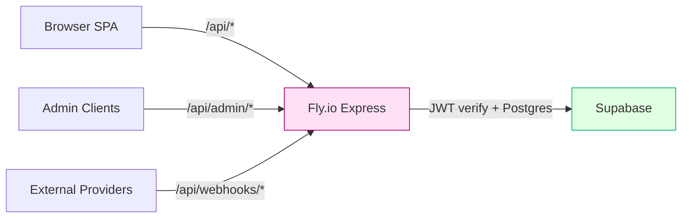
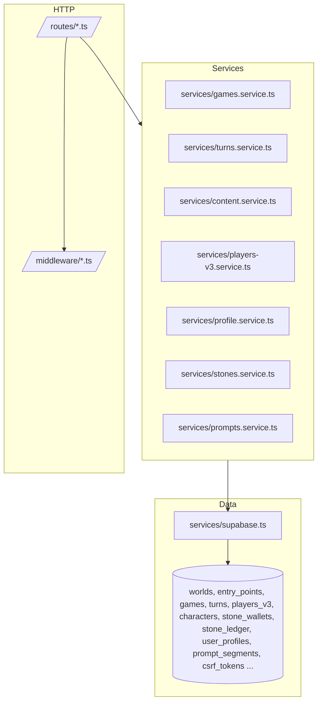
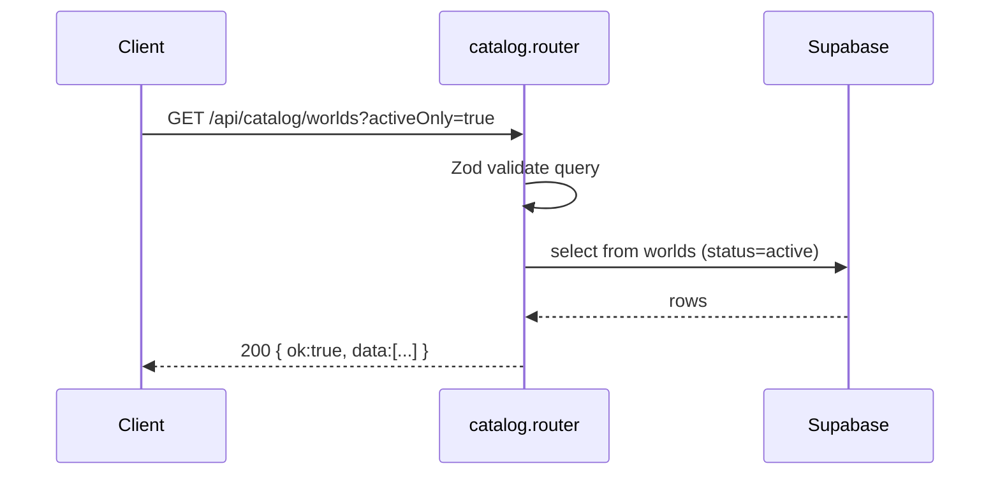
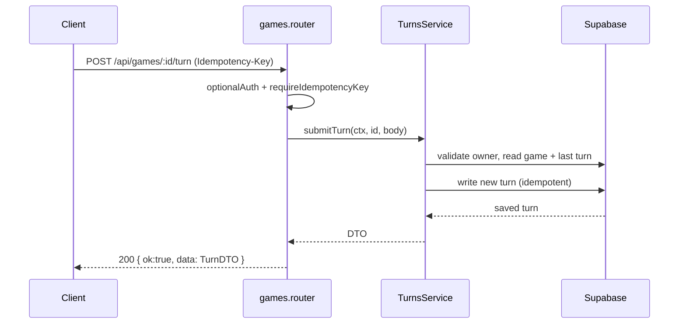
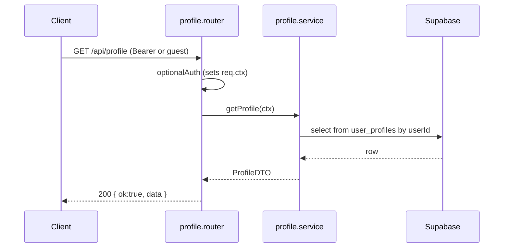
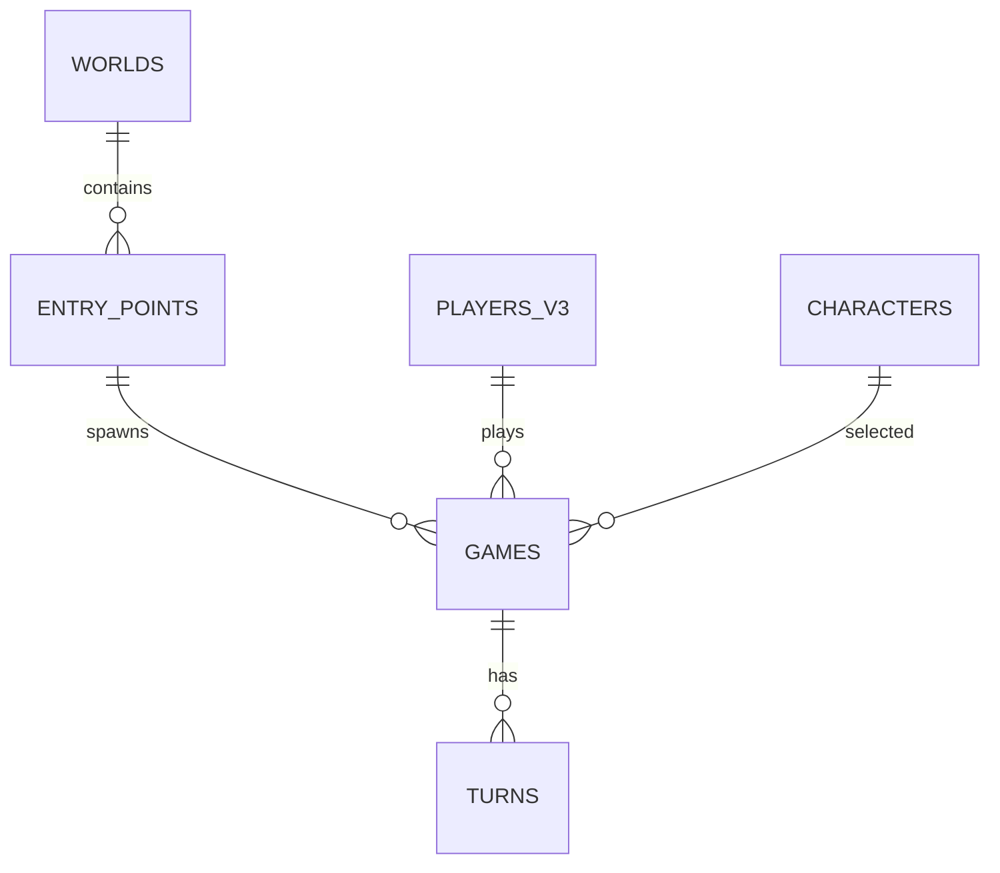

# Backend Architecture Map

## Executive Summary

Stone Caster’s backend is an Express server on Fly.io. It exposes REST endpoints under `/api/*` for catalog, gameplay (games/turns), profiles, players/characters, stones wallet, and admin. Authentication is via Supabase JWTs; guest flows use a durable cookie id forwarded as `X-Guest-Cookie-Id`.

- Entry: `backend/src/index.ts`; mounts routers under `/api/*`
- Framework: Express + Zod validation middleware
- Auth: Supabase JWT verification; guest or cookied identity via header/cookie; request context set on `req.ctx`
- Data: Supabase Postgres (SDK) with RLS enforced in table policies
- Observability: `observabilityMiddleware` adds `traceId`, structured logging, and request metrics
- Deployment: Fly.io (single process listening on `config.port`), health check `/health`

Primary endpoint lifecycle

1. Request hits `/api/*` → `observabilityMiddleware` adds trace context
2. Router matches path; optional/required auth middleware sets `req.ctx`
3. `validateRequest` (Zod) parses and validates `params|query|body`; idempotency checked for turn submissions
4. Handler calls service layer (e.g., `GamesService`, `ContentService`)
5. Services call Supabase (`from()`, `rpc()`) to read/write; map to DTOs from `shared/src/types`
6. `sendSuccess`/`sendErrorWithStatus` returns structured `{ ok, data | error }` with `traceId`

---

## Bird’s‑Eye Diagrams

### System Overview



### Layer Diagram



---

## Server Entry & Deployment

- Entry: `backend/src/index.ts` (sets CORS, JSON body limit, cookies, observability, health check)
- Routers mounted under `/api/*` (see “Routing & Middleware”)
- Swagger (dev): `/swagger.json` and `/api-docs` guarded by `NODE_ENV`
- Health: `GET /health` → `{ status: 'ok' }`
- Fly.io: single process, conventional HTTP listener on `config.port`

---

## Routing & Middleware Stack

Mounted routers (index → router file)

- `/api/config` → `backend/src/routes/config.ts`
- `/api/me` → `backend/src/routes/me.ts`
- `/api/profile` → `backend/src/routes/profile.ts`
- `/api/characters` → `backend/src/routes/characters.ts`
- `/api/players-v3` → `backend/src/routes/players-v3.ts`
- `/api/premades` → `backend/src/routes/premade-characters.ts`
- `/api/games` → `backend/src/routes/games.ts`
- `/api/worlds` → `backend/src/routes/worlds.ts`
- `/api/catalog` → `backend/src/routes/catalog.ts`
- `/api/content` → `backend/src/routes/content.ts`
- `/api/adventures` → `backend/src/routes/adventures.ts`
- `/api/search` → `backend/src/routes/search.ts`
- `/api/stones` → `backend/src/routes/stones.ts`
- `/api/subscription` → `backend/src/routes/subscription.ts`
- `/api/telemetry` → `backend/src/routes/telemetry.ts`
- `/api/story` → `backend/src/routes/story.ts`
- `/api/dice` → `backend/src/routes/dice.ts`
- `/api/webhooks` → `backend/src/routes/webhooks.ts`
- `/api/cookie-linking` → `backend/src/routes/cookie-linking.ts`
- `/api/auth` → `backend/src/routes/auth.ts`
- `/api/debug` → `backend/src/routes/debug.ts`
- `/api/admin` → `backend/src/routes/admin.ts`
- `/api/player` → `backend/src/routes/player.ts`

Middleware (examples)

- Auth: `backend/src/middleware/auth.ts` → `optionalAuth`, `jwtAuth`, `requireAuth`
- Validation: `backend/src/middleware/validation.ts` → `validateRequest`, `requireIdempotencyKey`, `rateLimit`
- Observability: `backend/src/middleware/observability.ts` → adds `traceId`, logging, metrics

---

## Endpoint → Handler → Service → Data Map (selected)

| Method | Path | Router | Handler/Notes | Service → Tables/RPC |
|---|---|---|---|---|
| GET | /api/catalog/worlds | `backend/src/routes/catalog.ts` | Validate query, list worlds | Content/inline → `worlds` |
| GET | /api/catalog/stories | `backend/src/routes/catalog.ts` | Zod for filters; list entry points | `entry_points` (+ joins) |
| POST | /api/games | `backend/src/routes/games.ts` | `optionalAuth`, create guest if needed | `GamesService.spawn` → `games`, `characters` |
| GET | /api/games/:id | `backend/src/routes/games.ts` | `optionalAuth`, owner scope via `req.ctx` | `GamesService.getGameById` → `games` |
| POST | /api/games/:id/turn | `backend/src/routes/games.ts` | `requireIdempotencyKey` header | `turnsService.submit` → `turns`, `turn_wal` |
| GET | /api/profile | `backend/src/routes/profile.ts` | `optionalAuth`; profile lookup | `profile.service` → `user_profiles`, `csrf_tokens` |
| PATCH | /api/profile | `backend/src/routes/profile.ts` | `requireAuth`, Zod body | `profile.service` → `user_profiles` |
| POST | /api/players-v3 | `backend/src/routes/players-v3.ts` | Create PlayerV3 | `players_v3` |
| GET | /api/premades | `backend/src/routes/premade-characters.ts` | List premades | `premade_characters` |
| POST | /api/auth/magic/start | `backend/src/routes/auth.ts` | Start magic link | Supabase auth API |

Sequence diagrams (examples)

GET /api/catalog/worlds



POST /api/games/:id/turn



GET /api/profile



---

## Data Layer & Supabase Integration

Tables/RPC observed (non‑exhaustive)

- Core: `worlds`, `entry_points`, `games`, `turns`, `characters`, `players_v3`
- Wallet: `stone_wallets`, `stone_ledger`, `guest_stone_wallets`, `stone_packs`
- Profile/Auth: `user_profiles`, `csrf_tokens`, `auth_ledger`
- Content: `prompt_segments`, `translation_cache`, `localization_packs`
- Ops/metrics (awf_*): `awf_rollup_daily`, `awf_funnels_daily`, `awf_incidents`, feature toggles, etc.
- RPC: `validate_prompt_dependencies`, `get_prompt_stats`, `check_rate_limit`, `begin_transaction`/`commit_transaction`/`rollback_transaction`

ERD (core gameplay)



Migrations: `db/migrations/*.sql` (timestamped); seeds in `db/seeds/*`; verification SQL in `db/verification/*`.

---

## AuthN/AuthZ

- JWT verification via Supabase: `backend/src/middleware/auth.ts:jwtAuth`
- Guest/cookied identity: `optionalAuth` inspects `Authorization`, cookies, `X-Guest-Cookie-Id`; sets `req.ctx = { userId, isGuest }`
- Guards: `requireAuth` for protected operations; admin routes add role checks in `routes/admin.ts`
- Frontend attaches headers in `frontend/src/lib/api.ts`

---

## Validation, Errors, and Observability

- Validation: `backend/src/middleware/validation.ts` → `validateRequest` (Zod), `requireIdempotencyKey`, `rateLimit`
- Errors: `utils/response.ts` → `sendSuccess`, `sendErrorWithStatus` produce `{ ok, data?, error?, meta:{traceId} }`
- Observability: `backend/src/middleware/observability.ts` adds `traceId`, structured logs, metrics; request logging wrapper collects latency/status
- Telemetry: `routes/telemetry.ts` and `services/telemetry.service.ts`

---

## Unused/Orphaned Handlers & Modules (static scan)

Routers present but not mounted in `index.ts` (internal/WIP). Consider moving to `routes/legacy/` or mounting under an admin flag.

| Path | Last Modified | Note |
|---|---:|---|
| backend/src/routes/awf-cloud-sync.ts | 2025-10-21 | Not mounted; cloud save/sync admin |
| backend/src/routes/awf-autoplay.ts | 2025-10-21 | Not mounted; autoplay tools |
| backend/src/routes/awf-economy-admin.ts | 2025-10-21 | Not mounted; economy admin |
| backend/src/routes/awf-liveops.ts | 2025-10-21 | Not mounted; liveops |
| backend/src/routes/awf-marketplace.ts | 2025-10-21 | Not mounted; marketplace |
| backend/src/routes/worldbuilder.ts | 2025-10-21 | Not mounted; worldbuilder APIs |

Also test/demo routers not mounted by design (e.g., `*.test.ts`, `integration.test.ts`).

Unreferenced services/repos (spot check)

- Inspect `backend/src/services/*` with dependency‑cruiser to confirm reachability from mounted routers

---

## Operational Notes

Required environment (names only)

- `PORT`, `NODE_ENV`
- `SUPABASE_URL`, `SUPABASE_ANON_KEY`
- `CORS_ORIGIN` (optional override)
- Provider keys for webhooks/integrations if enabled

Release checklist

- Update `shared/src/types/*` if DTOs change; bump consumers
- Validate router mounts in `index.ts` and update Swagger config
- Verify RLS implications for new queries; add `db/migrations/*.sql` and `db/verification/*.sql`
- Exercise idempotency and rate limits for POST endpoints

Backward compatibility

- Prefer additive changes to DTOs; for breaking changes, add new versioned endpoints or field fallbacks

---

## Appendix

Full endpoint index (method + subpath + router)

Source generated from `routes/*.ts` declarations; base prefix derives from the mount path above.

```text
adventures.ts
  GET    /
  GET    /slug/:slug
  GET    /:id

auth.ts
  POST   /magic/start
  POST   /magic/verify
  GET    /oauth/:provider/start
  GET    /oauth/:provider/callback
  POST   /logout

catalog.ts
  GET    /worlds
  GET    /worlds/:idOrSlug
  GET    /stories

characters.ts
  ... (create/list/get/update legacy character endpoints)

games.ts
  POST   /
  GET    /:id
  GET    /
  POST   /:id/turn

players-v3.ts
  POST   /
  GET    /:playerId
  PATCH  /:playerId
  GET    /world/:worldSlug

profile.ts
  GET    /
  PATCH  /

premade-characters.ts
  GET    /

worlds.ts
  GET    /
  GET    /:slug

stones.ts, subscription.ts, telemetry.ts, story.ts, dice.ts, content.ts, search.ts, me.ts, webhooks.ts, cookie-linking.ts, admin.ts, debug.ts
  ... see respective router files for full lists
```

Module index (by layer)

- Routers: `backend/src/routes/*.ts`
- Middleware: `backend/src/middleware/*.ts`
- Services: `backend/src/services/*.ts`
- Config: `backend/src/config/*.ts`

---

## Suggested Automation

- dependency-cruiser or madge: generate a graph from `routes/index.ts` → services → supabase adapters
- ts-morph/TS Compiler API: parse `router.METHOD('...')` registrations and emit a CSV of endpoints with files
- ripgrep + small Node script: combine mounts in `index.ts` with per‑router subpaths to compute full paths
- Add `npm run docs:arch` to regenerate this doc; keep output committed

