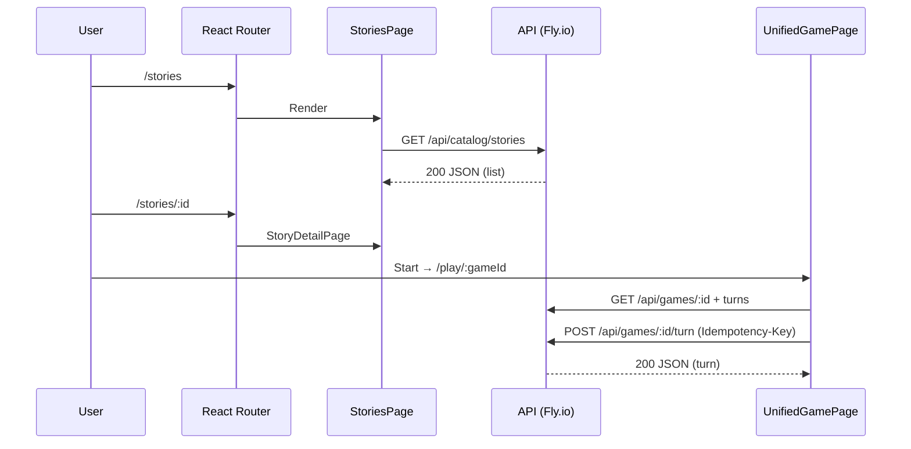

# Frontend Architecture Map

## Executive Summary

Stone Caster’s frontend is a mobile‑first React SPA (Vite) deployed on Cloudflare Pages/Workers. It renders client‑side in the browser and talks to a Node/Express API on Fly.io. Authentication and profiles use Supabase; the browser uses Supabase JS only for session/OAuth and attaches the JWT to backend API calls.

- Stack: React + React Router, shadcn/ui + Tailwind, React Query, Zustand
- Auth: Supabase session token → `Authorization: Bearer <jwt>`; guests via `X-Guest-Cookie-Id`
- API base: `frontend/src/lib/apiBase.ts` → absolute `http://localhost:3000` or `https://api.stonecaster.ai`
- Layout/providers: `AppLayout` + Theme/Toast/Query providers and `AuthRouter` gate
- Admin: `/admin/*` via `frontend/src/admin/AppAdminShell.tsx` + `AdminRoutes.tsx`

Primary navigation/request lifecycle

1. User hits a route → React Router renders page component (`frontend/src/App.tsx:LandingPage`, `StoriesPage`, …)
2. Page triggers React Query hooks or service calls (e.g., `frontend/src/lib/queries.ts`, `frontend/src/services/*`)
3. API client (`frontend/src/lib/api.ts`) attaches Supabase JWT and guest cookie headers
4. Request targets Fly.io API (e.g., `/api/catalog/stories`) → JSON response
5. React Query caches results, components render shadcn primitives; Zustand holds auth/game state
6. Protected routes use `ProtectedRoute` → redirect unauthenticated users to `/auth`
7. Errors are mapped to `AppError` and shown via `ErrorBoundary` and toast provider

---

## Bird’s‑Eye Diagrams

### System Overview

```mermaid
graph LR
  B[Browser (React SPA)] -->|HTML/CSS/JS| CF[Cloudflare Pages/Workers]
  B -->|XHR/Fetch /api/*| API[Fly.io Node/Express]
  B -->|Supabase JS (auth/session)| SB[Supabase]
  API -->|JWT verify + Postgres| SB
  
  classDef edge fill:#fff4e1,stroke:#b36b00
  classDef api fill:#ffe1f5,stroke:#b3006b
  classDef db fill:#e1ffe1,stroke:#00b36b
  class CF edge; class API api; class SB db;
```

### Frontend Layers

```mermaid
graph TB
  subgraph Providers/Layout
    Theme[ThemeProvider]
    Query[QueryClientProvider]
    AuthR[AuthRouter]
    Layout[AppLayout]
  end

  subgraph Pages
    Landing[LandingPage]
    Stories[StoriesPage]
    Story[StoryDetailPage]
    World[Worlds/WorldDetail]
    NPCs[NPCs/NPCDetail]
    Game[GamePage/UnifiedGamePage]
    Profile[Profile/Wallet]
    Admin[/admin/*]
  end

  subgraph Feature Components
    Catalog[CatalogGrid/Card/Filters]
    Gameplay[TurnInput/History/Choices]
    Character[PlayerV3Wizard/Creator]
  end

  subgraph Data & State
    APIClient[lib/api.ts]
    Queries[lib/queries.ts]
    Store[store/auth.ts, store/game.ts]
  end

  Providers/Layout --> Pages
  Pages --> Feature Components
  Pages --> Data & State
  Feature Components --> Data & State
```

---

## Definitions & Conventions

- Worlds: Game universes (catalogued, have slug) → `backend` table `worlds`
- Entry Points/Stories: Playable scenarios (a.k.a. stories) → `entry_points`
- Players/Characters: Player V3 models and legacy characters
- Game/Turn: Active session and its steps; turns are submitted with an idempotency key
- Stones: In‑game currency (wallet/ledger endpoints)

Naming/folders

- Pages in `frontend/src/pages/*` (PascalCase `*Page.tsx`)
- Route config: `frontend/src/App.tsx` and `frontend/src/admin/AdminRoutes.tsx`
- Components grouped by feature: `components/catalog`, `components/gameplay`, `components/character`, etc.
- State: `frontend/src/store/*` (Zustand); Queries: `frontend/src/lib/queries.ts`

---

## Routing Overview

Client rendering (SPA) on the browser; no SSR/ISR. Edge target: Cloudflare serves static assets; runtime work happens in the browser.

Top‑level routes (React Router in `frontend/src/App.tsx`)

- `/` → `frontend/src/pages/LandingPage.tsx`
- `/stories` → `frontend/src/pages/stories/StoriesPage.tsx`
- `/stories/:id` → `frontend/src/pages/stories/StoryDetailPage.tsx`
- `/play/start` → `frontend/src/pages/play/StartStoryPage.tsx`
- `/stories/:storyId/characters` → `frontend/src/pages/CharacterSelectionPage.tsx`
- `/stories/:storyId/create-character` → `frontend/src/pages/PlayerV3CreationPage.tsx`
- `/worlds` → `frontend/src/pages/worlds/WorldsPage.tsx`
- `/worlds/:slug` → `frontend/src/pages/worlds/WorldDetailPage.tsx`
- `/npcs` → `frontend/src/pages/npcs/NPCsPage.tsx`
- `/npcs/:id` → `frontend/src/pages/npcs/NPCDetailPage.tsx`
- `/rulesets` → `frontend/src/pages/rulesets/RulesetsPage.tsx`
- `/rulesets/:id` → `frontend/src/pages/rulesets/RulesetDetailPage.tsx`
- `/character-creation` → `frontend/src/pages/CharacterCreationPage.tsx`
- `/character-creator` → `frontend/src/pages/CharacterCreatorPage.tsx`
- `/wallet` (auth) → `frontend/src/pages/WalletPage.tsx`
- `/payments` (auth) → `frontend/src/pages/PaymentsPage.tsx`
- `/profile` (auth) → `frontend/src/pages/ProfilePage.tsx`
- `/support` → `frontend/src/pages/SupportPage.tsx`
- `/game/:id` → `frontend/src/pages/GamePage.tsx`
- `/play/:gameId` → `frontend/src/pages/UnifiedGamePage.tsx`
- `/unified-game/:id` → `frontend/src/pages/UnifiedGamePage.tsx`
- `/auth`, `/auth/signin`, `/auth/signup`, `/auth/success` → `frontend/src/pages/Auth*.tsx`
- `/admin/*` → `frontend/src/admin/AppAdminShell.tsx`
- `*` → `frontend/src/pages/NotFoundPage.tsx`

Admin nested routes (`frontend/src/admin/AdminRoutes.tsx`)

- `/admin` → `frontend/src/pages/admin/index.tsx`
- `/admin/entry-points` → `frontend/src/pages/admin/entry-points/index.tsx`
- `/admin/entry-points/:id` → `frontend/src/pages/admin/entry-points/id.tsx`
- `/admin/prompt-segments` → `frontend/src/pages/admin/prompt-segments/index.tsx`
- `/admin/npcs`, `/admin/npcs/new`, `/admin/npcs/:id`, `/admin/npcs/:id/edit` → `frontend/src/pages/admin/npcs/*.tsx`
- `/admin/entries`, `/admin/entries/:id/edit`, `/admin/entries/:id/preview` → `frontend/src/pages/admin/entries/*.tsx`
- `/admin/worlds`, `/admin/worlds/new`, `/admin/worlds/:id`, `/admin/worlds/:id/edit` → `frontend/src/pages/admin/worlds/*.tsx`
- `/admin/rulesets`, `/admin/rulesets/:id` → `frontend/src/pages/admin/rulesets/*.tsx`
- `/admin/reviews`, `/admin/reports`, `/admin/reports/:id`, `/admin/analytics`, `/admin/roles` → respective files under `frontend/src/pages/admin/*`

---

## Route → Component Tree (compact)

- `/stories`
  - `StoriesPage` → `components/filters/StoriesFilterBar`, `components/catalog/{CatalogGrid,CatalogCard,CatalogSkeleton,EmptyState}`
  - Data: `useStoriesQuery` → GET `/api/catalog/stories`

- `/stories/:id`
  - `StoryDetailPage` → feature details + CTA to start
  - Data: `useStoryDetailQuery` → GET `/api/catalog/entry-points/:idOrSlug`

- `/play/:gameId` and `/unified-game/:id`
  - `UnifiedGamePage`
    - `components/gameplay/{TurnInput,ChoiceButtons,HistoryFeed,TurnErrorHandler,StoneCost,StoneLedgerWidget,WorldRuleMeters}`
  - Data: `useQuery` keys for game, world, wallet, turns; POST turn → `/api/games/:id/turn`

- `/profile`
  - `ProfilePage` (auth‑gated via `ProtectedRoute`)
  - Data: GET `/api/profile`, PATCH `/api/profile`

- `/admin/*`
  - `AppAdminShell` → header/sidebar + `AdminRoutes`
  - Nested pages render form tables using shadcn/ui; guarded via `Guarded` role gate

Mermaid example (Catalog → Story → Play)



---

## Component Inventory (selected)

| Name | Path | Type | Used By | Imported In | Notes |
|---|---|---|---|---|---|
| AppLayout | frontend/src/components/layout/AppLayout.tsx | layout | all routes | `App.tsx` | Shell with header/slots |
| AuthRouter | frontend/src/components/AuthRouter.tsx | provider/router | all routes | `App.tsx` | Handles auth redirects |
| ProtectedRoute | frontend/src/components/auth/ProtectedRoute.tsx | gate | `/profile`, `/wallet`, `/payments`, `/scenarios` | `App.tsx` | Requires auth |
| StoriesFilterBar | frontend/src/components/filters/StoriesFilterBar.tsx | presentational | `/stories` | `StoriesPage.tsx` | Filter controls |
| CatalogGrid/Card | frontend/src/components/catalog/{CatalogGrid,CatalogCard}.tsx | presentational | `/stories` | `StoriesPage.tsx` | Cards and grid |
| PlayerV3Wizard | frontend/src/components/character/PlayerV3Wizard.tsx | feature | character create | `PlayerV3CreationPage.tsx` | Zod + mutations |
| TurnInput | frontend/src/components/gameplay/TurnInput.tsx | feature | `/play/:gameId` | `UnifiedGamePage.tsx` | Submit turn |
| TurnErrorHandler | frontend/src/components/gameplay/TurnErrorHandler.tsx | cross‑cutting | game routes | `GamePage.tsx`, `UnifiedGamePage.tsx` | Error UI |
| WorldRuleMeters | frontend/src/components/gameplay/WorldRuleMeters.tsx | presentational | game routes | `UnifiedGamePage.tsx` | World meters |
| AdminNav | frontend/src/admin/components/AdminNav.tsx | navigation | `/admin/*` | `AppAdminShell.tsx` | Sidebar nav |

Cross‑cutting: `ErrorBoundary`, `ToastProvider`, theme toggle, Skip Navigation.

---

## Data/State Wiring (critical routes)

- Stories (`/stories`)
  - React Query: `useStoriesQuery` (key: `stories:list` + filters)
  - API: GET `/api/catalog/stories`
  - Cache: 5m stale, 10m GC (see `App.tsx` QueryClient)

- Story detail (`/stories/:id`)
  - React Query: `useStoryDetailQuery`
  - API: GET `/api/catalog/entry-points/:idOrSlug`

- Unified game (`/play/:gameId` or `/unified-game/:id`)
  - Queries: game, world, wallet, turns (keys include gameId)
  - Mutations: POST turn with `Idempotency-Key`
  - API: `/api/games/:id`, `/api/games/:id/turn`, plus lookups

- Profile (`/profile`)
  - Query: GET `/api/profile` (includes CSRF token query)
  - Mutations: PATCH `/api/profile`, POST `/api/auth/logout`

- Character create (`/stories/:storyId/create-character`)
  - Mutation: POST `/api/players-v3` (Player V3), or legacy `/api/characters`

State stores

- `frontend/src/store/auth.ts` (Zustand) holds user/profile, derived booleans (guest/auth/cookied)
- `frontend/src/store/game.ts` for local game state helpers

---

## Assets & Performance Considerations

- Code split primarily by route; heavy pages like admin and game views render after data resolves
- Images and OG metadata managed per page (e.g., `StoriesPage` updates document tags)
- Avoid large providers in hot paths; use memoization for gameplay components prone to re‑renders
- Ensure idempotent turn submissions to prevent duplicate work on flaky networks
- Cloudflare environment: treat as static assets + browser runtime (no SSR specifics)

---

## Unused/Orphaned Components (static scan)

Components not referenced by routes/layouts (likely legacy/WIP). Last modified dates are from file metadata.

| Path | Last Modified | Recommendation |
|---|---:|---|
| frontend/src/components/error/ErrorBoundary.tsx | 2025-10-21 | Duplicate of `components/ErrorBoundary.tsx` → delete or consolidate |
| frontend/src/components/authoring/DocEditor.tsx | 2025-10-21 | Authoring WIP, not imported by pages → move to `legacy/` if unused |
| frontend/src/components/authoring/DocExplorer.tsx | 2025-10-21 | Authoring WIP → move to `legacy/` |
| frontend/src/components/authoring/PreviewPanel.tsx | 2025-10-21 | Authoring WIP → move to `legacy/` |

Pages defined but not routed from `App.tsx` (or only referenced by tests):

| Path | Last Modified | Recommendation |
|---|---:|---|
| frontend/src/pages/GamePlayPage.tsx | 2025-10-21 | Legacy; replaced by `UnifiedGamePage` → delete/move |
| frontend/src/pages/HomePage.tsx | 2025-10-21 | Not linked; superseded by `LandingPage` → delete/move |
| frontend/src/pages/AdventuresPage.tsx | 2025-10-21 | Not routed → delete/move |
| frontend/src/pages/AdventureDetailPage.tsx | 2025-10-21 | Not routed → delete/move |
| frontend/src/pages/WorldSelectionPage.tsx | 2025-10-21 | Not routed → delete/move |
| frontend/src/pages/CharacterListPage.tsx | 2025-10-21 | Not routed → delete/move |

Hooks with zero non‑test references (indicative; verify before removal): `useCatalog.ts`, `useNPCPacks.ts`, `usePromptSegments.ts`, `useErrorHandler.ts`, `useAuthRedirect.ts`, `useAdminService.ts`.

---

## Assumptions & Uncertainty

- Feature flags/guards: `AdminRoutes` uses `Guarded` role checks; exact flag sources not fully mapped
- Dynamic imports: none detected in routing; admin shells are static imports
- Some hooks/services may be used by admin/testing flows; verify before removal

How to verify

- Run a dependency graph (see Suggested Automation) from routed pages/layouts and compare reachability
- Search usages with ripgrep for each candidate and confirm no dynamic usage
- Manually click through `/`, `/stories`, `/worlds`, `/play/:id`, `/admin/*` to validate component trees

---

## Suggested Automation

- dependency-cruiser or madge: generate import graphs and detect orphans
- ts-morph or TS Compiler API: walk `App.tsx`/`AdminRoutes.tsx` to dump a route → import tree
- ts-prune + unimported: find unused exports/files; filter out tests and storybook
- Simple CLI: `npm run docs:arch` to regenerate tables/diagrams into this file

Example dev scripts (to document in package.json)

- `docs:arch:routes` → ts-node script to parse React Router configs and emit route index
- `docs:arch:deps` → dependency-cruiser to DOT/JSON + convert to Mermaid
- `docs:arch:unused` → ts-prune/unimported to list unused components/hooks

---

## Appendix

Full route index (path → file)

- See Routing Overview tables above; source of truth in `frontend/src/App.tsx` and `frontend/src/admin/AdminRoutes.tsx`

Feature flag/role tag index

- Admin pages gated by `Guarded` in `frontend/src/admin/routeGuard.tsx`

Glossary (UI terms)

- Catalog (grid/cards), Turn (input, choices, history), Entry Point (story), World, Wallet

