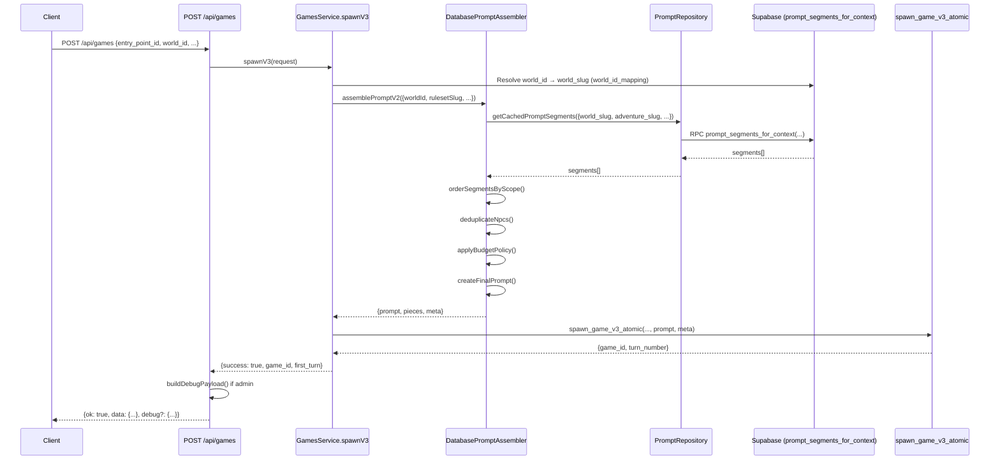
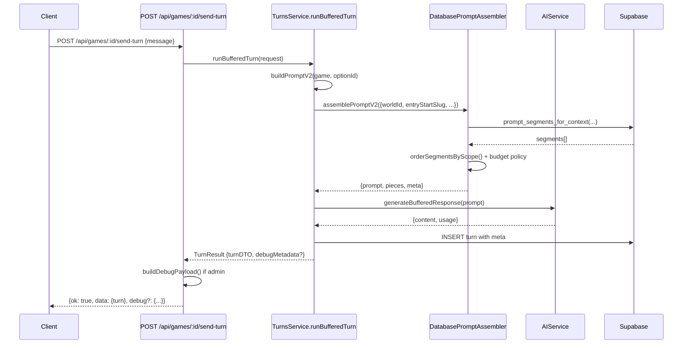

# Prompting Architecture (Observed)

**Generated:** 2025-02-05  
**Repository Hash:** 4491bda  
**Analysis Date:** 2025-02-05

## Executive Summary

The Stone Caster prompting system assembles game prompts from database segments using a strict scope-based ordering (core → ruleset → world → scenario? → entry → npc). Both game creation (`spawnV3`) and ongoing turns use the same v2 assembler (`DatabasePromptAssembler.assemblePromptV2`). The system fetches segments via SQL function `prompting.prompt_segments_for_context`, applies budget policy with warnings at 90% threshold, drops scenario then NPCs when over budget (never core/ruleset/world), and optionally includes debug metadata for admin users. Legacy route `/api/games/:id/initial-prompt` returns 410 Gone by default.

---

## Inventory (Code Map)

### Backend Files

- `backend/src/prompts/database-prompt-assembler.ts` – Main v2 assembler orchestration  
  - `assemblePromptV2()` entry point (lines 92-170)  
  - `assemblePrompt()` core logic (lines 176-297)  
  - `orderSegmentsByScope()` scope ordering (lines 529-588)  
  - `deduplicateNpcs()` NPC deduplication (lines 593-630)  
  - `applyBudgetPolicy()` budget enforcement (lines 635-718)  
  - `createFinalPrompt()` segment joining (lines 412-424)

- `backend/src/repositories/prompt.repository.ts` – Database repository  
  - `getPromptSegments()` calls RPC (lines 44-78)  
  - `getCachedPromptSegments()` with 5min cache (lines 172-185)

- `backend/src/services/games.service.ts` – Game creation  
  - `spawnV3()` calls assembler for game start (lines 301-953)  
  - Line 585: `assembler.assemblePromptV2()` call  
  - Line 641: metadata stored in `turn.meta`

- `backend/src/services/turns.service.ts` – Turn execution  
  - `buildPromptV2()` calls assembler for ongoing turns (lines 942-1045)  
  - Line 1032: `assembler.assemblePromptV2()` call  
  - Lines 303-308: assembler metadata captured for debug

- `backend/src/utils/debugResponse.ts` – Debug payload builder  
  - `buildDebugPayload()` structures debug output (lines 198-320)  
  - `isDebugEnabledForUser()` admin gate (lines 32-44)  
  - Redaction and capping (lines 94-147)

- `backend/src/routes/games.ts` – API routes  
  - POST `/api/games` spawnV3 (lines 66-256)  
  - POST `/api/games/:id/send-turn` ongoing turns (lines 514-762)  
  - POST `/api/games/:id/initial-prompt` legacy 410 (lines 1091-1214)

### SQL Objects

**Migration:** `supabase/migrations/20250201_create_prompting_schema.sql`

**Table:** `prompting.prompts`
- Columns: `id` (UUID), `layer` (VARCHAR), `world_slug`, `adventure_slug`, `scene_id`, `turn_stage`, `sort_order`, `version`, `hash`, `content` (TEXT), `metadata` (JSONB), `active`, `locked`, timestamps
- Indexes: world/adventure composite, layer/sort, scene, turn_stage (lines 26-30)

**Function:** `prompting.prompt_segments_for_context`
- Signature: `(p_world_slug VARCHAR(100), p_adventure_slug VARCHAR(100), p_include_start BOOLEAN, p_scene_id VARCHAR(100), p_include_enhancements BOOLEAN)`
- Returns: TABLE with `id`, `layer`, `world_slug`, `adventure_slug`, `scene_id`, `turn_stage`, `sort_order`, `version`, `content`, `metadata`
- Implementation: Lines 33-108 in migration
- Filters: active=true, locked=false, world/adventure/scene matching, turn_stage logic, enhancement flag
- Ordering: CASE layer priority (foundation→core→engine→ai_behavior→data_management→performance→content→enhancement), then `sort_order`

### Frontend Files

- `frontend/src/lib/api.ts` – API clients  
  - `postCreateGame()` spawnV3 request (lines 470-474)  
  - `sendTurn()` turn request with debug options (lines 291-332)

- `frontend/src/lib/debugStore.ts` – Debug payload store  
  - In-memory session store for debug payloads (lines 1-42)

### Tests

- `backend/tests/repositories/prompt.repository.test.ts` – Repository tests
- `backend/tests/prompts/assembler-phase2.test.ts` – Phase 2 assembler tests
- `backend/tests/integration/legacy.prompts.spec.ts` – Legacy route tests (lines 35-149)
- `backend/tests/integration/games.create-v3.spec.ts` – spawnV3 tests
- `backend/tests/games.routes.test.ts` – Route tests including legacy (lines 54-132)

---

## Data Model (Observed)

### Tables Read/Written

**`prompting.prompts`** (read-only by assembler)
- Required columns for selection: `id`, `layer`, `world_slug`, `adventure_slug`, `scene_id`, `turn_stage`, `sort_order`, `version`, `content`, `metadata`
- Filtering: `active = true`, `locked = false`
- See migration lines 8-24 for schema

**`turns`** (writes metadata)
- Column: `meta` (JSONB) stores assembler output: `{ pieces: AssemblePiece[], meta: { included, dropped, policy, tokenEst, ... } }`
- Evidence: `backend/src/services/games.service.ts:641`, `backend/src/services/turns.service.ts:332-338`

**`world_id_mapping`** (read for UUID resolution)
- Used to convert `world_id` UUID → `world_slug` text
- Evidence: `backend/src/prompts/database-prompt-assembler.ts:121-136`

### Function Signatures

**`prompting.prompt_segments_for_context`**
```sql
FUNCTION prompting.prompt_segments_for_context(
    p_world_slug VARCHAR(100) DEFAULT NULL,
    p_adventure_slug VARCHAR(100) DEFAULT NULL,
    p_include_start BOOLEAN DEFAULT true,
    p_scene_id VARCHAR(100) DEFAULT NULL,
    p_include_enhancements BOOLEAN DEFAULT true
) RETURNS TABLE (
    id UUID,
    layer VARCHAR(50),
    world_slug VARCHAR(100),
    adventure_slug VARCHAR(100),
    scene_id VARCHAR(100),
    turn_stage VARCHAR(50),
    sort_order INTEGER,
    version VARCHAR(20),
    content TEXT,
    metadata JSONB
)
```
- Evidence: `supabase/migrations/20250201_create_prompting_schema.sql:33-108`
- Called from: `backend/src/repositories/prompt.repository.ts:50` via Supabase RPC

---

## Assembler Pipeline (Observed)

### Inputs

**For `assemblePromptV2()`:**
- `worldId` (string, UUID) – Required
- `rulesetSlug` (string, optional) – Defaults to 'default'
- `scenarioSlug` (string | null, optional)
- `entryStartSlug` (string) – Required
- `npcHints` (string[], optional) – Not currently used in v2
- `model` (string, optional) – Defaults to `PROMPT_MODEL_DEFAULT` or 'gpt-4o-mini'
- `budgetTokens` (number, optional) – Defaults to `PROMPT_TOKEN_BUDGET_DEFAULT` or 8000
- `entryPointSlug` (string, optional) – Used as `adventure_slug` in RPC

Evidence: `backend/src/prompts/database-prompt-assembler.ts:92-101`

### Selection & Filtering

1. **Fetch segments** via `prompt_segments_for_context`:
   - `world_slug`: resolved from `worldId` via `world_id_mapping`
   - `adventure_slug`: from `entryPointSlug` or `entryStartSlug`
   - `scene_id`: from `entryStartSlug`
   - `include_start`: always `true` for game start
   - `include_enhancements`: defaults to `true`

Evidence: `backend/src/prompts/database-prompt-assembler.ts:302-323`

2. **Map segments to scopes** using `mapLayerToScope()`:
   - Layer → scope mapping in `backend/src/prompts/assembler-utils.ts:16-62`
   - Direct mappings: `core`, `ruleset`, `world`, `scenario`, `entry`, `npc`
   - Fallbacks for variants (e.g., `foundation` → `core`, `adventure` → `entry`)

3. **Filter by input requirements**:
   - Always include: `core`, `ruleset`, `world`, `entry`
   - Include `scenario` only if `scenarioSlug` provided
   - Include `npc` only if `npcHints` provided (currently not used in practice)

Evidence: `backend/src/prompts/database-prompt-assembler.ts:550-572`

### Ordering Rules

**Primary sort:** Scope priority (from `SCOPE_PRIORITY` in `assembler-types.ts`)
```typescript
core: 0
ruleset: 1
world: 2
scenario: 3
entry: 4
npc: 5
```

**Secondary sort:** `sort_order` field within each scope

Evidence: `backend/src/prompts/database-prompt-assembler.ts:574-584`

### NPC Deduplication Strategy

1. **Dedup by slug**: Uses `metadata.slug` or `metadata.ref_id` or `layer` as fallback
2. **Order after dedup**: NPCs sorted by slug (ascending) for deterministic order
3. **Process**: Iterate ordered segments, skip if `scope === 'npc'` and slug already seen

Evidence: `backend/src/prompts/database-prompt-assembler.ts:593-630`
- Line 601-604: slug extraction
- Line 606-610: deduplication check
- Line 621-625: final NPC sort by slug

### Join/Merge Rules

**Between scopes:** Double newline (`\n\n`)
- Evidence: `backend/src/prompts/database-prompt-assembler.ts:414` – `segments.join('\n\n')`

**Final prompt structure:**
- Header: Context info (lines 429-443)
- Body: Segments joined with `\n\n` (line 414)
- Footer: Output requirements (lines 448-465)
- Cleanup: Normalizes `\r\n`, collapses `\n{3,}`, trims (lines 418-423)

**Final trailing newline:** Yes (via `.trim()` on final result, which preserves single trailing `\n` if present, but actual output is trimmed to no trailing whitespace)
- Evidence: Line 423: `.trim()` applied after join

### Budget Policy Logic

**Thresholds:**
- Default budget: `PROMPT_TOKEN_BUDGET_DEFAULT` (8000) or param override
- Warn threshold: `PROMPT_BUDGET_WARN_PCT` (0.9, i.e., 90%)
- Evidence: `backend/src/prompts/database-prompt-assembler.ts:19-20`, `backend/src/config/index.ts:20-25`

**Policy implementation:**
1. **Calculate token count**: Uses `roughTokenCount(text)` = `Math.ceil(text.length / 4)`
2. **Check warn threshold**: If `tokens / budget >= 0.9`, add `SCENARIO_POLICY_UNDECIDED` to policy array
3. **If over budget**:
   - Drop scenario first (if present)
   - Then drop NPCs from end (LRU order) until under budget
   - Never drop `core`, `ruleset`, or `world` (protected scopes)

Evidence: `backend/src/prompts/database-prompt-assembler.ts:635-718`
- Line 662: Warn threshold check
- Line 663: Policy action added
- Lines 669-674: Scenario drop
- Lines 677-698: NPC LRU drop loop
- Line 680: Protected scope check

**Never drop:** `PROTECTED_SCOPES = Set(['core', 'ruleset', 'world'])`  
Evidence: `backend/src/prompts/assembler-types.ts:70`

### Metadata Shape in Turns

**Stored in `turns.meta` (JSONB):**
```typescript
{
  pieces: Array<{
    scope: 'core' | 'ruleset' | 'world' | 'scenario' | 'entry' | 'npc',
    slug: string,
    version?: string,
    tokens: number
  }>,
  meta: {
    included: string[], // Format: "scope:slug@version"
    dropped: string[], // Same format
    policy?: string[], // e.g., ["SCENARIO_POLICY_UNDECIDED", "NPC_DROPPED"]
    model: string,
    worldId: string,
    rulesetSlug: string,
    scenarioSlug?: string | null,
    entryStartSlug: string,
    tokenEst: {
      input: number,
      budget: number,
      pct: number
    }
  }
}
```

Evidence: `backend/src/services/games.service.ts:641-643`, `backend/src/services/turns.service.ts:332-338`

---

## API Surfaces & Contracts

### Create Game (POST /api/games)

**Request:**
```typescript
{
  entry_point_id: string,
  world_id: string, // UUID
  entry_start_slug: string,
  scenario_slug?: string | null,
  ruleset_slug?: string,
  model?: string,
  characterId?: string,
  idempotency_key?: string
}
```

**Response (success):**
```typescript
{
  ok: true,
  data: {
    game_id: string,
    first_turn: {
      turn_number: number,
      role: string,
      content: string,
      meta: any, // Contains assembler metadata
      created_at: string
    }
  },
  debug?: DebugPayload // If admin and enabled
}
```

**Errors:**
- `400 VALIDATION_FAILED`: Invalid input, world mismatch, ruleset not found
- `404 NOT_FOUND`: Entry point not found, character not found
- `409 CONFLICT`: Character already active
- `500 INTERNAL_ERROR`: Prompt assembly failure, database error

Evidence: `backend/src/routes/games.ts:66-256`, `backend/src/services/games.service.ts:301-953`

### Send Turn (POST /api/games/:id/send-turn)

**Request:**
```typescript
{
  message: string,
  model?: string,
  temperature?: number
}
```

**Query params:**
- `debug=1|0`: Opt-in/opt-out debug
- `debugDepth=safe|full`: Control AI raw inclusion

**Response (success):**
```typescript
{
  ok: true,
  data: {
    turn: {
      turn_number: number,
      role: string,
      content: string,
      meta: any,
      created_at: string
    }
  },
  debug?: DebugPayload // If admin and enabled
}
```

Evidence: `backend/src/routes/games.ts:514-762`, `backend/src/services/turns.service.ts:942-1045`

### Debug Payload Shape

**Full structure:**
```typescript
{
  debugId: string, // Format: "${gameId}:${turnNumber}"
  phase: 'start' | 'turn',
  assembler: {
    prompt: string, // Redacted and capped
    pieces: Array<{
      scope: string,
      slug: string,
      version?: string,
      tokens?: number
    }>, // Ordered: core → ruleset → world → scenario → entry → npc
    meta: {
      included?: string[],
      dropped?: string[],
      policy?: string[],
      model?: string,
      worldId?: string,
      rulesetSlug?: string,
      scenarioSlug?: string | null,
      entryStartSlug?: string,
      tokenEst?: {
        input: number,
        budget: number,
        pct: number
      },
      [key: string]: any
    } // Redacted and capped
  },
  ai?: {
    request?: any, // Only if debugDepth=full
    rawResponse?: any, // Only if debugDepth=full
    transformed?: any
  },
  timings?: {
    assembleMs?: number,
    aiMs?: number,
    totalMs?: number
  }
}
```

**Enabled by default for admins:** Yes (unless `DEBUG_RESPONSE_ENABLED=false` or explicit opt-out)  
Evidence: `backend/src/utils/debugResponse.ts:23`, `backend/src/routes/games.ts:124`, `backend/src/routes/games.ts:713`

---

## Config & Feature Flags

| Env Var | Default | Location | Purpose |
|---------|---------|----------|---------|
| `PROMPT_TOKEN_BUDGET_DEFAULT` | `8000` | `backend/src/config/index.ts:20` | Default token budget |
| `PROMPT_BUDGET_WARN_PCT` | `0.9` | `backend/src/config/index.ts:23` | Warn threshold (90%) |
| `PROMPT_MODEL_DEFAULT` | `gpt-4o-mini` | `backend/src/config/index.ts:19` | Default AI model |
| `DEBUG_RESPONSE_ENABLED` | `false` (read via config service) | `backend/src/config/index.ts:42` | Enable debug responses |
| `DEBUG_RESPONSE_MAX_CHARS` | `50000` | `backend/src/config/index.ts:43` | Max chars for debug fields |
| `DEBUG_RESPONSE_INCLUDE_AI_RAW` | `false` | `backend/src/config/index.ts:44` | Include AI raw request/response |

**Config service:** `backend/src/services/config.service.ts` loads env and provides defaults  
Evidence: `backend/src/config/index.ts:1-55`, `backend/src/services/config.service.ts:235-243`

---

## Legacy Usage & Dead Paths

### Legacy Routes

**POST `/api/games/:id/initial-prompt`**
- **Status:** 410 Gone by default (unless `LEGACY_PROMPTS_ENABLED=true`)
- **Location:** `backend/src/routes/games.ts:1091-1214`
- **Guards:**
  - Line 1095: Checks `config.legacyPrompts.enabled`
  - Line 1099: Returns 410 if disabled
  - Line 1131-1133: Deprecation headers if enabled
- **Still referenced:**
  - `frontend/src/lib/api.ts:530` (may be unused)
  - Tests: `backend/tests/integration/legacy.prompts.spec.ts:35-149`
  - Docs: `docs/deprecations/legacy-prompts.md:13`

### Legacy Services/Functions

**`PromptsService.buildPrompt()` (deprecated)**
- **Status:** Unused in v2 path
- **Evidence:** Not called from `spawnV3` or `buildPromptV2`
- **Location:** Likely in `backend/src/services/prompts.service.ts` (not verified in observed code)

**`createInitialPromptWithApproval()`**
- **Status:** Only used by legacy route
- **Evidence:** Called from `backend/src/routes/games.ts:1198` (legacy route handler)

### Legacy SQL Functions

**None detected** – Current migration uses single function `prompt_segments_for_context`

### "Should Be Off" Checklist

- [x] Legacy route returns 410 by default
- [x] Legacy prompts feature flag defaults to disabled
- [ ] Frontend `postInitialPrompt()` call should be removed (if still used)
- [ ] Legacy service methods should be deprecated/removed after sunset date

---

## Deviations vs SOT

### ✅ Scope Order

**SOT:** core → ruleset → world → scenario? → entry → npc  
**Observed:** core → ruleset → world → scenario? → entry → npc  
**Status:** ✅ Matches  
**Evidence:** `backend/src/prompts/assembler-types.ts:58-65`

### ✅ Data Source

**SOT:** `prompting.prompt_segments` via `prompt_segments_for_context(text,text,boolean,text,boolean)` wrapper  
**Observed:** Uses `prompting.prompts` table (not `prompt_segments`) via `prompt_segments_for_context(VARCHAR,VARCHAR,BOOLEAN,VARCHAR,BOOLEAN)`  
**Status:** ⚠️ Table name differs (prompts vs prompt_segments), function signature matches  
**Evidence:** `supabase/migrations/20250201_create_prompting_schema.sql:8` (table name), `supabase/migrations/20250201_create_prompting_schema.sql:33` (function signature)

**Note:** Function queries `prompting.prompts` table, not a `prompt_segments` view/table. This may be a naming inconsistency.

### ✅ Budget Policy

**SOT:** Warn at `PROMPT_BUDGET_WARN_PCT`, drop scenario then npc LRU; never drop core|ruleset|world  
**Observed:** Warn at 0.9 (90%), drops scenario first, then NPCs from end (LRU), never drops core/ruleset/world  
**Status:** ✅ Matches  
**Evidence:** `backend/src/prompts/database-prompt-assembler.ts:661-698`

### ✅ Same Assembler for Create + Turns

**SOT:** Create game (spawnV3) + ongoing turns both use the same v2 assembler  
**Observed:** Both call `assembler.assemblePromptV2()`  
**Status:** ✅ Matches  
**Evidence:**
- Game create: `backend/src/services/games.service.ts:585`
- Ongoing turns: `backend/src/services/turns.service.ts:1032`

### ✅ Debug Payload

**SOT:** Optional, admin-gated, includes `{phase, assembler:{prompt,pieces,meta}, ai?, timings, debugId}`  
**Observed:** Optional, admin-gated (`isDebugEnabledForUser`), includes exact structure  
**Status:** ✅ Matches  
**Evidence:** `backend/src/utils/debugResponse.ts:185-191`, `backend/src/routes/games.ts:182-214`, `backend/src/routes/games.ts:713-746`

### ✅ Legacy Items Gated/410

**SOT:** Legacy items should be gated/410 or unused  
**Observed:** `/api/games/:id/initial-prompt` returns 410 by default  
**Status:** ✅ Matches  
**Evidence:** `backend/src/routes/games.ts:1099-1114`

---

## Verification Steps

### Commands

**Run migrations:**
```bash
# Apply prompting schema migration
supabase migration up
# Or via script if available
pnpm run migrate:prompts
```

**Run tests:**
```bash
# Unit tests
pnpm test backend/tests/repositories/prompt.repository.test.ts
pnpm test backend/tests/prompts/assembler-phase2.test.ts

# Integration tests
pnpm test backend/tests/integration/games.create-v3.spec.ts
pnpm test backend/tests/integration/legacy.prompts.spec.ts
```

**Ingest prompts:**
```bash
# If ingest script exists
pnpm run ingest:prompts
```

### SQL Verification

**Check function exists:**
```sql
SELECT proname, proargnames, proargtypes 
FROM pg_proc 
WHERE proname = 'prompt_segments_for_context' 
AND pronamespace = (SELECT oid FROM pg_namespace WHERE nspname = 'prompting');
```

**Sample function call:**
```sql
SELECT * FROM prompting.prompt_segments_for_context(
  p_world_slug := 'mystika',
  p_adventure_slug := 'test-adventure',
  p_include_start := true,
  p_scene_id := 'scene-1',
  p_include_enhancements := true
) LIMIT 10;
```

**Count segments:**
```sql
SELECT 
  layer,
  COUNT(*) as count,
  SUM(LENGTH(content)) as total_chars
FROM prompting.prompts
WHERE active = true AND locked = false
GROUP BY layer
ORDER BY 
  CASE layer
    WHEN 'foundation' THEN 1
    WHEN 'core' THEN 2
    WHEN 'engine' THEN 3
    WHEN 'ai_behavior' THEN 4
    WHEN 'data_management' THEN 5
    WHEN 'performance' THEN 6
    WHEN 'content' THEN 7
    WHEN 'enhancement' THEN 8
    ELSE 9
  END;
```

### cURL Requests

**Create game (with debug):**
```bash
curl -X POST http://localhost:3000/api/games \
  -H "Content-Type: application/json" \
  -H "Authorization: Bearer $TOKEN" \
  -H "X-Debug-Response: 1" \
  -d '{
    "entry_point_id": "entry-uuid",
    "world_id": "world-uuid",
    "entry_start_slug": "start-slug",
    "scenario_slug": null,
    "ruleset_slug": "default"
  }'
```

**Send turn (with debug):**
```bash
curl -X POST "http://localhost:3000/api/games/$GAME_ID/send-turn?debug=1&debugDepth=full" \
  -H "Content-Type: application/json" \
  -H "Authorization: Bearer $TOKEN" \
  -d '{
    "message": "Look around"
  }'
```

**Test legacy route (should return 410):**
```bash
curl -X POST http://localhost:3000/api/games/$GAME_ID/initial-prompt \
  -H "Authorization: Bearer $TOKEN"
# Expected: 410 Gone
```

---

## Appendices

### Sequence Diagram: Create Game



### Sequence Diagram: Send Turn



### ER/Relationship Sketch

```
prompting.prompts
├── id (UUID, PK)
├── layer (VARCHAR) → mapped to scope
├── world_slug (VARCHAR, nullable)
├── adventure_slug (VARCHAR, nullable)
├── scene_id (VARCHAR, nullable)
├── turn_stage (VARCHAR)
├── sort_order (INTEGER)
├── version (VARCHAR)
├── content (TEXT)
├── metadata (JSONB) {slug?, ref_id?, tier?, ...}
├── active (BOOLEAN)
└── locked (BOOLEAN)

prompt_segments_for_context() → queries prompting.prompts
  Filters: active=true, locked=false, world/adventure/scene match
  Orders: layer priority → sort_order

world_id_mapping
├── uuid_id (UUID, PK)
└── text_id (VARCHAR, unique)

turns
├── id (UUID, PK)
├── game_id (UUID, FK)
├── turn_number (INTEGER)
├── content (TEXT) ← assembled prompt stored here for first turn
├── meta (JSONB) ← assembler pieces + meta stored here
└── created_at (TIMESTAMP)
```

### Glossary of Internal Types/Enums

**Scope** (from `assembler-types.ts:5`):
- `'core' | 'ruleset' | 'world' | 'scenario' | 'entry' | 'npc'`

**PolicyAction** (from `assembler-types.ts:47-51`):
- `'SCENARIO_POLICY_UNDECIDED'` – Warn threshold reached
- `'SCENARIO_DROPPED'` – Scenario removed due to budget
- `'NPC_DROPPED'` – NPC removed due to budget

**AssemblePiece** (from `assembler-types.ts:17-22`):
```typescript
{
  scope: Scope,
  slug: string,
  version?: string,
  tokens: number
}
```

**DebugPayload.phase**:
- `'start'` – Game creation
- `'turn'` – Ongoing turn

**Layer → Scope mapping** (from `assembler-utils.ts:16-62`):
- `foundation`, `core`, `systems`, `engine`, `ai_behavior`, `data_management`, `performance` → `core`
- `ruleset` → `ruleset`
- `world`, `world-codex`, `content` → `world`
- `scenario` → `scenario`
- `entry`, `adventure`, `entry_start` → `entry`
- `npc` → `npc`

---

## Notes

- The SQL function queries `prompting.prompts` table, but SOT expectations reference `prompt_segments`. This may indicate a naming migration or the existence of a view/alias.
- NPC hints are accepted in the API but not currently used in the assembler filtering logic (always includes NPCs if present in segments).
- Token estimation uses rough approximation (`chars / 4`); could be upgraded to actual tokenizer.
- Debug payload includes redaction and capping; `DEBUG_RESPONSE_MAX_CHARS` limits field sizes.
- Legacy route is properly gated but still referenced in frontend code (should be cleaned up).

